# Asciiville

Asciiville is where you go for ASCII Art, animations, and utilities.
The Asciiville project provides integration and extension of several
packages as well as providing convenience commands to invoke a variety
of components used to display ASCII Art, animations, and text based
utilities to perform common operations in a text-only environment.

## Table of contents

1. [Overview](#overview)
1. [Asciiville Ascii Art Galleries](#asciiville-ascii-art-galleries)
1. [Asciiville Commands](#asciiville-commands)
1. [Quickstart](#quickstart)
1. [Requirements](#requirements)
1. [Installation](#installation)
    1. [Debian package installation](#debian-package-installation)
    1. [RPM package installation](#rpm-package-installation)
    1. [BB AAlib Demo](#bb-aalib-demo)
1. [Configuration](#configuration)
    1. [NeoMutt email configuration](#neomutt-email-configuration)
        1. [NeoMutt encrypted passwords](#neomutt-encrypted-passwords)
        1. [Replacing an existing NeoMutt configuration](#replacing-an-existing-neomutt-configuration)
    1. [Mutt email configuration](#mutt-email-configuration)
1. [Documentation](#documentation)
    1. [Btop++ README](#btop++-readme)
    1. [Cbftp README](#cbftp-readme)
    1. [Ddgr README](#ddgr-readme)
    1. [Man Pages](#man-pages)
    1. [Usage](#usage)
    1. [Example invocations](#example-invocations)
1. [Adding an ASCII Art Gallery](#adding-an-ascii-art-gallery)
1. [Figlet fonts](#figlet-fonts)
1. [Build](#build)
1. [Removal](#removal)
1. [What is ASCII](#what-is-ascii)
    1. [ASCII Art History](#ascii-art-history)
1. [Screenshots](#screenshots)
1. [Videos](#videos)

## Overview

Asciiville integrations and extensions are aimed at the character
based terminal user. They enable easy to use seamlessly
integrated control of a variety of ASCII Art, animation, and
utilities in a lightweight character based environment.

At the core of Asciiville is the `asciiville` command which acts as
a front-end for a variety of terminal commands and `tmux` sessions.

The `asciiville` command can be used to invoke:

* The lightweight character based system monitor, `btop`
* The lightweight character based web browser, `w3m`
* The lightweight character based mail client, `neomutt`
* The lightweight character based RSS feed reader, `newsboat`
* The lightweight character based FTP client, `cbftp`
* The lightweight character based music player, `mpcplus`
* The lightweight character based file manager, `ranger`
* The lightweight character based disk usage analyzer, `gdu`
* The lightweight character based journal app, `jrnl`
* The ascii diagram generator, `diagon`
* One or more terminal emulators running a command
* A tmux session
* A command line web search
* A zoomable map of the world
* Command line character based Twitter client
* Translate words and phrases from and to a wide variety of languages
* A network download/upload speed test
* The AAlib BB demo running in a tmux session (Debian based systems only)
* The ASCII text-based dungeon game `nethack` with Extended ASCII glyphs
* The `cmatrix` command that displays the screen from "The Matrix"
* Character based ASCII Art and image to ascii conversion utility `jp2a`
* Display system info
* Display the Phase of the Moon
* Display a weather report
* Display the MusicPlayerPlus or RoonCommandLine interactive menus
* Any character based client the user wishes to run
* One of several asciimatics animations optionally accompanied by audio

Integration is provided for:

* [btop](btop/README.md), character based system monitor
* [cbftp](cbftp/README), character based FTP client
* [ddgr](ddgr/README.md), command line web search
* [diagon](diagon/README.md), command line ascii diagram generator
* [jrnl](https://jrnl.sh/en/stable/), a simple command line journal application
* [w3m](http://w3m.sourceforge.net/), another character based web browser
* [lynx](https://lynx.invisible-island.net/), character based web browser
* [mutt](http://www.mutt.org/), character based email client
* [neomutt](http://neomutt.org/), character based email client
* [newsboat](https://github.com/newsboat/newsboat), character based RSS feed reader
* [ranger](https://ranger.github.io/), character based file manager
* [gdu](https://github.com/dundee/gdu#readme), character based disk usage analyzer
* [got](https://github.com/fedeztk/got), text based translation tool
* [mpcplus](https://github.com/doctorfree/MusicPlayerPlus/blob/master/mpcplus/README.md), featureful ncurses based Music Player client
* [mplayer](http://mplayerhq.hu/design7/info.html), a media player
* [asciimatics](https://github.com/peterbrittain/asciimatics) - automatically display a variety of character based animation effects
* [asciinema](https://asciinema.org/) - automatically create ascii character based video clips
* [rainbowstream](https://github.com/orakaro/rainbowstream) - command line character based Twitter client
    * See [the rainbowstream usage manual](https://rainbowstream.readthedocs.io/en/latest/#usage) to get started
* [mapscii](https://github.com/rastapasta/mapscii#readme), zoomable map of the world
* [cmatrix](https://github.com/abishekvashok/cmatrix), screen from "The Matrix"
* [nethack](https://en.wikipedia.org/wiki/NetHack), ASCII text dungeon game
* [ninvaders](https://en.wikipedia.org/wiki/Space_Invaders), ASCII text version of Space Invaders
* [tetris](https://en.wikipedia.org/wiki/Tetris), ASCII text version of Tetris
* [tmux](https://github.com/tmux/tmux/wiki), a terminal multiplexer
* [wttr.in](https://github.com/chubin/wttr.in), console-oriented weather report
* Enhanced key bindings for extended control of terminal windows
* Several terminal emulators
    * xfce4-terminal
    * gnome-terminal
    * tilix
    * cool-retro-term
* [MusicPlayerPlus](https://github.com/doctorfree/MusicPlayerPlus#readme), character based suite of commands to manage music server and player
* [RoonCommandLine](https://github.com/doctorfree/RoonCommandLine#readme), command line control of the Roon audio system over a local network

## Asciiville Ascii Art Galleries

The Asciiville project includes many curated Ascii Art galleries.
These include hundreds of high resolution Ascii Art files created
by Asciiville author and artist, Dr. Ronald Joe Record. The Asciiville
package, when installed, provides the following Ascii Art galleries
located in the default Ascii Art Gallery folder `/usr/share/asciiville/art/`:

```
Art - A collection of fine art transformed into Ascii Art
Doctorwhen - Some of Doctor When's fantastic art
Dragonflies - Photos of dragonflies converted to Ascii using Asciiville tools
Family - Photos of my family converted to Ascii using Asciiville tools
Fractals - Images of fractals converted to Ascii using Asciiville tools
Frax - Images made with Frax converted to Ascii using Asciiville tools
Friends - Photos of my friends converted to Ascii using Asciiville tools
Iterated - Images made with iteration converted to Ascii using Asciiville tools
Lyapunov - Lyapunov fractals converted to Ascii using Asciiville tools
Mixed - A mix of photos and fractals converted to Ascii using Asciiville tools
Nature - Photos of nature converted to Ascii using Asciiville tools
Owls - Photos of owls converted to Ascii using Asciiville tools
Space - Photos of space converted to Ascii using Asciiville tools
Wallpapers - Pretty wallpapers converted to Ascii using Asciiville tools
Waterfalls - Photos of waterfalls converted to Ascii using Asciiville tools
```

All of these galleries may be viewed using the menus in the `asciiville`
command. Asciiville users can add their own custom galleries using the
conversion and generation tools provided by Asciiville. Custom menus added
to the Ascii Art Gallery folder will automatically appear in the
`asciiville` menu selections.

## Asciiville Commands

Asciiville adds the following commands to your system:

* **asciiville** : primary user interface, invokes terminal emulators, ascii animations, system monitor, mail client, file manager, web browser, and more
* **btop** : character based system monitor
* **cbftp** : character based FTP client
* **ascinit** : one-time initializaton of a user's Asciiville configuration
* **btop-tmux** : runs btop in a tmux session
* **bb-tmux** : runs aalib bb demo in a tmux session
* **asciisplash** : fun ascii art screens using ASCIImatics animations. Ascii art commands:
    * **asciiart** : ASCIImatics animated art images
    * **asciijulia** : ASCIImatics animated zoom on a Julia Set
    * **asciiplasma** : ASCIImatics animated plasma graphic
    * **asciimpplus** : ASCIImatics animated Music Player Plus splash screen
* **chktermcolor** : checks if a terminal has 24-bit true color support
* **cmatrix** : display that screen from "The Matrix"
* **ddgr** : command line web search
* **got** : text based translation tool (only added if `go` is installed)
* **jp2a** : image to ascii conversion utility
* **mapscii** : character based zoomable map of the world
* **nethack** : character based dungeon game
* **rainbowstream** : command line Twitter client
* **set_xfce_font** : sets an xfce4-terminal window's font and font size
* **set_xfce_trans** : sets an xfce4-terminal window's transparency level
* **show_ascii_art** : display ascii art, convert images to ascii art
* **show_moon** : display the phase of the Moon
* **show_weather** : display a weather report
* **tdraw** : ASCII drawing tool (only added if `go` is installed)
* **termprofset** : set/restore default profile or font settings for the Gnome, Xfce4, and Tilix terminals

Additional detail and info can be found in the
[Asciiville Wiki](https://github.com/doctorfree/Asciiville/wiki).

## Quickstart

* Install the latest Debian or RPM format installation package from the [Asciiville Releases](https://github.com/doctorfree/Asciiville/releases) page
* Run the `ascinit` command
    * Must be done as a normal user with `sudo` privilege
	* Run `ascinit -c` to perform a console initialization (no graphical utilities)
* Initialize the command line Twitter client by invoking the `rainbowstream` command and authorizing the app to access your Twitter account
* Execute the `asciiville` command in interactive menu mode by running `asciiville -i`
* See the [online asciiville man page](https://github.com/doctorfree/Asciiville/wiki/asciiville.1) or `man asciiville` for different ways to invoke the `asciiville` command

## Requirements

Asciiville can be installed on Debian or RPM based Linux systems.
All of the following dependencies/requirements are automatically
installed if needed when using the Debian or RPM format package install.

* asciinema
* cmatrix
* figlet
* gdu
* gnupg
* imagemagick
* jq
* mplayer
* neofetch
* pandoc
* python3
* ranger
* speedtest-cli
* tmux
* w3m

After installing Asciiville the `ascinit` command performs a one-time
initialization in which several additional packages are optionally installed.
This post-installation configuration can install any or all of several
terminal emulators along with character based tools. Terminal emulators
supported by Asciiville available during post-install configuration are:

* cool-retro-term
* gnome-terminal
* tilix
* xfce4-terminal

Tools installed during post-installation configuration include:

* asciimatics
* got (if the `go` command is installed)
* jrnl
* mutt
* neomutt
* pipx
* rainbowstream
* tdraw (if the `go` command is installed)

Asciiville does not install the `go` command. In order for the `got` and
`tdraw` commands to be installed during post-installation configuration,
the `go` command needs to be previously installed. On most Debian based
systems `go` can be installed with the command `sudo apt install golang-go`.
On RPM based systems `go` can be installed with a command like
`sudo dnf install golang`. See
[https://go.dev/doc/install](https://go.dev/doc/install)
for a guide on installing `go` on your system.

## Installation

Asciiville v1.3.0 and later can be installed on Linux systems using
either the Debian packaging format or the Red Hat Package Manager (RPM).
Currently tested platforms include Ubuntu Linux 20.04, Fedora Linux 35,
and Raspbian Linux Bullseye. Installation packages are provided for
the `amd64` and `armhf` architectures in Debian packaging format and the
`x86_64` architecture in Red Hat package manager (RPM) format.

See the [Build](#build) section below to compile and build a package on
an Linux platform other than those for which packages are provided.

### Debian package installation

Many Linux distributions, most notably Ubuntu and its derivatives, use the
Debian packaging system.

To tell if a Linux system is Debian based it is usually sufficient to
check for the existence of the file `/etc/debian_version` and/or examine the
contents of the file `/etc/os-release`.

To install on a Debian based Linux system, download the latest Debian format
package from the
[Asciiville Releases](https://github.com/doctorfree/Asciiville/releases).

Install the Asciiville package by executing the command

```console
sudo apt install ./Asciiville_<version>-<release>.amd64.deb
```
or
```console
sudo dpkg -i ./Asciiville_<version>-<release>.amd64.deb
```

or, on a Raspberry Pi:

```console
sudo apt install ./Asciiville_<version>-<release>.armhf.deb
```
or
```console
sudo dpkg -i ./Asciiville_<version>-<release>.armhf.deb
```

### RPM package installation

Red Hat Linux, SUSE Linux, and their derivatives use the RPM packaging
format. RPM based Linux distributions include Fedora, AlmaLinux, CentOS,
openSUSE, OpenMandriva, Mandrake Linux, Red Hat Linux, and Oracle Linux.

To install on an RPM based Linux system, download the latest RPM format
package from the
[Asciiville Releases](https://github.com/doctorfree/Asciiville/releases).

Install the Asciiville package by executing the command

```console
sudo dnf localinstall ./Asciiville_<version>-<release>.x86_64.rpm
```
or
```console
sudo yum localinstall ./Asciiville_<version>-<release>.x86_64.rpm
```

### BB AAlib Demo

The BB AAlib Demo is not included in some distributions' default RPM
repositories. Because of that, it is not included as a dependency in
RPM installs. However, the `asciiville` command will utilize the BB Demo
if it is installed. To activate this feature it may be necessary to
manually install the `bb` package. This may entail enabling a third-party
repository. For example, on Fedora Linux, to install `bb`:

* Add RPM Fusion repositories to your system
* Download latest rpmsphere-release rpm from
    * https://github.com/rpmsphere/noarch/tree/master/r
* Install rpmsphere-release rpm:
    * `sudo rpm -Uvh rpmsphere-release*rpm`
* Install bb rpm package:
    * `sudo dnf install bb`

The BB AAlib Demo is not required. It's just a fun demo.

## Configuration

Asciiville preferences are maintained in `$HOME/.config/asciiville/init`.
Preferences set in interactive menu mode are preserved over invocations
of `asciiville`. For example, if a command and terminal were selected
in interactive menu mode then those selections will automatically be
applied the next time `asciiville` is run.

After installing Asciiville, initialize Asciiville configuration and
install additional features by executing the `ascinit` command as a normal
user with `sudo` privilege. The `ascinit` command will customize the
configuration of several Asciiville packages and install additional
packages. If you wish to perform a "console" initialization on a headless
system or a system on which there is no available X Server, then execute
the command `ascinit -c` rather than `ascinit`.

```console
# Execute the ascinit command:
ascinit
# Or, on a console system without the X11 windowing system:
ascinit -c
```

Asciiville creates several default configuration files for utilities
included in the distribution. Examine these files to further customize
each program. The default configuration generated when running the
`ascinit` command should suffice and may be satisfactory.

Generated configuration files include:

* `$HOME/.config/btop/btop.conf` : Btop++ system monitor
* `$HOME/.config/got/config.yml` : Got text translation tool
* `$HOME/.config/neomutt/` : NeoMutt email client startup files
* `$HOME/.config/neofetch/config.conf` : NeoFetch system info script
* `$HOME/.config/jrnl/` : Journal command `jrnl` configuration file
* `$HOME/.config/ranger/rifle.conf` : Rifle, Ranger's file opener
* `$HOME/.mutt/muttrc` : Mutt email client
* `$HOME/.newsboat/` : Newsboat RSS feed reader configuration files
* `$HOME/.rainbow_config.json` : Rainbowstream Twitter client
* `$HOME/.tmux.conf` : Tmux terminal multiplexer
* `$HOME/.w3m/` : W3M web browser custom configuration
    * W3M web browser configured to act as a Markdown pager
	* W3M configuration enables support for many MIME types and external apps

These override or extend the settings in the utilities' global configuration
files, typically installed in `/etc/`. For example, the global configuration
for the Ranger File Manager can be found in `/etc/ranger/config/`. The W3M
web browser is configured in `/etc/w3m/`, and the NeoMutt global config is
`/etc/neomuttrc`.

After installing Asciiville and running the `ascinit` command, initialize the
the command line Twitter client by invoking the `rainbowstream` command and
authorizing the app to access your Twitter account.

### NeoMutt email configuration

The [NeoMutt](https://neomutt.org/) email client is an improved Mutt client.
Asciiville installs NeoMutt as a dependency and provides support for configuring
and launching NeoMutt. Setup for NeoMutt is similar to setup for Mutt.

The `ascinit` command creates an initial NeoMutt configuration in
`$HOME/.config/neomutt/`. In order to use the NeoMutt email client it will be
necessary to configure `$HOME/.config/neomutt/accounts/*` with your name,
email address, and credentials. The default NeoMutt user configuration files
configure NeoMutt for use with GMail. This can be modified by editing the
accounts configured in `$HOME/.config/neomutt/neomuttrc`.

Comments in `$HOME/.config/neomutt/accounts/gmail`
provide pointers to configuring your credentials with GMail. If Google 2FA
Authentication is enabled in your Google account, create an App password for
NeoMutt. See
[https://security.google.com/settings/security/apppasswords](https://security.google.com/settings/security/apppasswords)

NeoMutt can use the output of external commands to set a configuration value.
Storing a password in a configuration file is generally a bad idea. Passwords
and other sensitive material can be stored elsewhere and a command used to
retrieve and set them in the configuration file. Storing a plain text password
in a file and reading that file from the NeoMutt configuration is better than
placing the password directly in the configuration file. But it is still plain
text in a file somewhere. A more secure manner of storing passwords can be
implemented using encryption with utilities like PGP or GPG.

#### NeoMutt encrypted passwords

To use an encrypted password with NeoMutt, follow the guide at:
[https://www.xmodulo.com/mutt-email-client-encrypted-passwords.html](https://www.xmodulo.com/mutt-email-client-encrypted-passwords.html)
The ArchLinux wiki has a good article on configuring GPG to encrypt/decrypt
passwords and email. See
[https://wiki.archlinux.org/title/GnuPG](https://wiki.archlinux.org/title/GnuPG)

For example, if you have encrypted your Google NeoMutt App password in the
file `~/.neomutt/gmail.gpg` then the following can be used for GMail
authentication in `$HOME/.config/neomutt/accounts/gmail`

Create a GPG key pair
```console
gpg --gen-key
```

Create a file containing the encrypted password:
```console
echo "your_gmail_app_password" > ~/.config/neomutt/gmail
gpg -r youremail@gmail.com -e ~/.config/neomutt/gmail
rm -f ~/.config/neomutt/gmail
chmod 600 ~/.config/neomutt/gmail.gpg
```

Configure NeoMutt authentication in `$HOME/.config/neomutt/accounts/gmail`
```console
set imap_pass="`gpg --batch -q --decrypt ~/.neomutt/gmail.gpg`"
```

The first time `neomutt` is executed it will prompt you for the passphrase
used to create the GPG key pair. If you check the box to use the GPG
passphrase manager then subsequent invocations of NeoMutt will not prompt
for the passphrase. This assumes the `gpg-agent` has been installed and
configured. Many modern Linux distributions do this by default.

Creating and using encrypted passwords is strongly recommended. That's why
I spent the time to write this section of the README. A similar procedure
can be used with Mutt.

To transfer a previously generated GnuPG key pair from another system, see
[https://gist.github.com/angela-d/8b27670bac26e4bf7c431715fef5cc51](https://gist.github.com/angela-d/8b27670bac26e4bf7c431715fef5cc51)

#### Replacing an existing NeoMutt configuration

Asciiville `ascinit` skips NeoMutt initialization and configuration if it
detects an existing `$HOME/.config/neomutt/` folder. If you have already
configured NeoMutt then `ascinit` does not touch the existing configuration.
However, you may want to examine the NeoMutt configuration provided in
Asciiville by viewing the files in `/usr/share/asciiville/neomutt/`. If you
want to use the Asciiville NeoMutt setup files rather than your previously
configured setup, move the existing `$HOME/.config/neomutt/` folder aside
and rerun `ascinit`.

### Mutt email configuration

Alternatively, you may prefer using the older but still maintained and robust
[Mutt](https://www.mutt.org/) email client. Asciiville checks to see if Mutt
is installed and, if so, provides support for launching it as well as NeoMutt.
Mutt and NeoMutt can coexist peacefully.

Mutt is not installed as a dependency during the Asciiville installation.
If you wish to use the Mutt integration in Asciiville, Mutt must be installed.
A Mutt installation and Asciiville Mutt configuration can be accomplished
by running the command `ascinit -m` or `ascinit -M` for both Mutt and NeoMutt.
If no text based email client is desired, then configuration for both Mutt
and NeoMutt can be skipped by executing `ascinit -N` during initialization.

In order to use the Mutt email client it will be necessary to configure
`$HOME/.mutt/.muttrc` with your email address, name, and credentials.
Comments in `$HOME/.mutt/.muttrc` provide pointers to configuring your
credentials with GMail. If Google 2FA Authentication is enabled in your
Google account, create an App password for NeoMutt. See
[https://security.google.com/settings/security/apppasswords](https://security.google.com/settings/security/apppasswords)

Asciiville `ascinit` Mutt initialization does not overwrite any previously
existing Mutt configuration files in `$HOME/.mutt/`. However, you may want
to examine the Mutt configuration provided in Asciiville by viewing the files
in `/usr/share/asciiville/mutt/`. If you want to use the Asciiville Mutt setup
files rather than your previously configured setup, move the existing
`$HOME/.mutt/` folder aside and rerun `ascinit`.

There are many Mutt configuration guides on the Internet.
ArchLinux has a good guide at
[https://wiki.archlinux.org/title/Mutt](https://wiki.archlinux.org/title/Mutt).

## Documentation

All Asciiville commands have manual pages. Execute `man <command-name>`
to view the manual page for a command. The `asciiville` frontend is the primary
user interface for Asciiville and the manual page for `asciiville` can be
viewed with the command `man asciiville`. Most commands also have
help/usage messages that can be viewed with the **-u** argument option,
e.g. `asciiville -u`.

In interactive mode, the `asciiville` command presents a series of menus from
which commands can be executed. Each of these menus provides an entry point
for a 'Help' menu that can be displayed by typing 'h' at the prompt. The
Asciiville Help menu contains a large number of menu entries providing access
to manuals and man pages describing usage of the Asciiville components.
Run the `asciiville` command with no arguments or the `-i` argument to
bring up the interactive menu interface.

### Btop++ README
- [**btop/README.md**](btop/README.md) - Introduction to the btop system monitor

### Cbftp README
- [**cbftp/README**](cbftp/README) - Introduction to the cbftp FTP client
- [**Video on Cbftp**](https://youtu.be/dOIwg9nMF10) - Video introduction to the cbftp FTP client

### Ddgr README
- [ddgr](ddgr/README.md), Introduction to the command line web search utility

### Man Pages

- [**asciiville**](markdown/asciiville.1.md) : Primary Asciiville user interface
- [**asciiart**](markdown/asciiart.1.md) : asciimatics animation of art images
- [**asciijulia**](markdown/asciijulia.1.md) : asciimatics animation of a Julia Set
- [**asciimpplus**](markdown/asciimpplus.1.md) : asciimatics animation of Asciiville intro
- [**asciiplasma**](markdown/asciiplasma.1.md) : asciimatics animation with Plasma effect
- [**asciisplash-tmux**](markdown/asciisplash-tmux.1.md) : Asciiville asciimatics animations in a tmux session
- [**asciisplash**](markdown/asciisplash.1.md) : Asciiville asciimatics animations
- [**mpcinit**](markdown/mpcinit.1.md) : Asciiville initialization
- [**btop-tmux**](markdown/btop-tmux.1.md) : Asciiville in a tmux session
- [**btop**](markdown/btop.1.md) : Asciiville system monitor
- [**cbftp**](markdown/cbftp.1.md) : Asciiville FTP client
- [**diagon**](markdown/diagon.1.md) : Ascii diagram generator
- [**show_ascii_art**](markdown/show_ascii_art.1.md) : Display ascii art, convert images to ascii art
- [**show_moon**](markdown/show_moon.1.md) : Display the phase of the Moon
- [**show_weather**](markdown/show_weather.1.md) : Display a weather report
- [**termprofset**](markdown/termprofset.1.md) : Manipulate default terminal profile or font settings

### Usage

Many of the Asciiville features and facilities work perfectly well with
both fixed and variable width fonts. However, Ascii Art and graphics are
best viewed using a Monospaced or "fixed-width" font such as "Courier",
"Lucida Console", "Monaco", "Consolas", "Inconsolata", or "Monospace Regular".
Variable width fonts can interfere with the intended display of Ascii Art.

The Asciiville package creates an "Asciiville" profile in the `gnome-terminal`
and `tilix` terminal emulators to configure use of a Monospaced font as well
as invoking `xfce4-terminal` with a *--font* option specifying a Monospaced
font. The `asciiville` command attempts to ensure the use of a Monospaced
font where it is possible but options do exist for the Asciiville user to
use whatever the current terminal window might be. In this case, "Use Current
Terminal", it is up to the Asciiville user to configure the terminal window
for Monospaced font use.

#### Usage message for the `asciiville` command

The usage message for `asciiville` provides a brief summary of the command
line options:

```
Usage: asciiville [-a] [-A] [-b] [-c command] [-C] [-d] [-f] [-F]
	[-g] [-i] [-I] [-jJ] [-k] [-l] [-L level] [-m] [-M] [-N]
	[-n num] [-p] [-P script] [-r] [-R] [-s song] [-S] [-t] [-T]
	[-U] [-v] [-V show] [-w] [-W] [-x] [-X] [-y] [-Y] [-z] [-Z] [-u]

Terminal/Command options:
	-c 'command' indicates use 'command'
		If 'command' is keyword 'maps' then display a map using mapscii
		If 'command' is keyword 'moon' then display the phase of the Moon
		If 'command' is keyword 'news' then display RSS news feeds
		If 'command' is keyword 'search' then a web search is performed
		If 'command' is keyword 'speed' then a speed test is performed
		If 'command' is keyword 'translate' then the translation tool is run
		If 'command' is keyword 'twitter' then a Twitter client is run
		If 'command' is keyword 'weather' then display a weather report
		Otherwise, 'command' will be executed in a terminal window
	-d indicates use disk usage analyzer as default command
	-f indicates use cbftp/ncftp as the default command
	-F indicates fullscreen display
	-g indicates use gnome terminal emulator
	-i indicates start asciiville in interactive mode
	-I indicates display system info
	-l indicates use lynx web browser as the default command
	-L 'level' use lolcat coloring, 'level' can be '1' or '2' (animate)
	-r indicates use retro terminal emulator
	-t indicates use tilix terminal emulator
	-U indicates set command to Ninvaders
	-w indicates use w3m web browser as the default command
	-W indicates use cmatrix as the default command
	-x indicates use xfce4 terminal emulator
	-X indicates run commands in current terminal window
	-y indicates use ranger file manager as the default command
	-Y indicates use NetHack dungeon game as the default command
	-z indicates use neomutt email client as the default command
Slideshow/ASCIImatics animation options:
	-A indicates use Asciiville scenes in ASCIImatics display
	-a indicates play audio during ASCIImatics display
	-b indicates use backup audio during ASCIImatics display
	-C indicates cycle slideshow endlessly (Ctrl-c to exit show)
	-j indicates use Julia Set scenes in ASCIImatics display
	-J indicates Julia Set with several runs using different parameters
	-m indicates use MusicPlayerPlus scenes in ASCIImatics display
	-M indicates use MusicPlayerPlus MPD client as default command
	-n num specifies the number of times to cycle ASCIImatics scenes
	-N indicates use alternate comments in Plasma ASCIImatics scenes
	-p indicates use Plasma scenes in ASCIImatics display
	-P script specifies the ASCIImatics script to run
	-s song specifies a song to accompany an ASCIImatics animation
		'song' can be the full pathname to an audio file or a
		relative pathname to an audio file in the MPD music library
		or ~/Music/
	-S indicates display ASCIImatics splash animation
	-V 'show' displays an ascii art slide show
		'show' can be Art, Doctorwhen, Dragonflies, Fractals,
			Lyap, Mixed, Owls, Space, or Waterfalls
	-Z indicates do not play audio during slideshow/animation

General options:
	-k indicates kill Asciiville tmux sessions and ASCIImatics scripts
	-R indicates record tmux session with asciinema
	-T indicates use a tmux session for either ASCIImatics or command
	-v displays the Asciiville version and exits
	-u displays this usage message and exits

Invoked without any arguments, 'asciiville' will display a menu
```

#### Usage message for the `show_ascii_art` command

```
Usage: show_ascii_art [-a art] [-A art_dir] [-b] [-c] [-C]
	[-d font_dir] [-D seconds] [-F large_font] [-f small_font] [-g]
	[-i image] [-l] [-L] [-n tabs] [-N depth] [-o] [-p palette] [-q] [-r] [-s show]
	[-S] [-u] [-t first_text] [-T second_text] [-h height] [-w width]
Where:
	-a 'art' specifies which ascii art to display
	-A 'art_dir' specifies the path to the ascii art folder
	-b when generating ascii art use a border
	-c when generating ascii art use ANSI colors
	-C center ascii art on screen if border detected
	-d 'font_dir' specifies the path to the figlet fonts
	-D 'seconds' specifies the delay, in seconds, between screens
	-g convert image to grayscale
	-i 'image' specifies an image file to convert to ascii art
	-l use lolcat coloring
	-L lists the ascii art in the 'art_dir' and exits
	-f 'small_font' specifies the figlet font to use for small text
	-F 'large_font' specifies the figlet font to use for large text
	-n 'tabs' specifies the number of tabs to indent image display
	-N 'depth' specifies the color depth
		'depth' can be '4' (for ANSI), '8' (for 256 color palette)
		or '24' (for truecolor or 24-bit color)
	-o indicates overwrite any existing ascii art when saving
	-p 'palette' specifies which character set to use for ascii art
		'palette' can be one of 'def', 'long', 'rev', 'longrev'
		'def' is the default set, 'long' a long set,
		'rev' reverses default, 'longrev' reverses long
		Any other argument to '-p' will be taken as the character set
	-q don't display text, just the ascii art
	-r indicates select random fonts
	-s 'show' slide show of ascii art
		'show' can be Art, Fractals, Lyap, Owls, Waterfalls, Mixed
	-S indicates save converted image ascii art in art_dir
	-t 'first_text' specifies the first text to display
	-T 'second_text' specifies the second text to display
	-u displays this usage message and exits
	-h 'height' specifies the height of the converted ascii art
	-w 'width' specifies the width of the converted ascii art
		If only one of 'width' and 'height' is provided,
		calculate the other from image aspect ratio
```

#### Usage message for the `asciisplash` command

```
Usage: asciisplash [-A] [-a] [-b] [-C] [-c num] [-d] [-jJ] [-m] [-p] [-s song] [-u]
Where:
	-A indicates use all effects
	-a indicates play audio during ASCIImatics display
	-b indicates use backup audio during ASCIImatics display
	-C indicates use alternate comments in Plasma effect
	-c num specifies the number of times to cycle
	-d indicates enable debug mode
	-j indicates use Julia Set effect
	-J indicates Julia Set with several runs using different parameters
	-m indicates use Asciiville effect
	-p indicates use Plasma effect
	-s song specifies the audio file to play as accompaniment
		'song' can be the full pathname to an audio file or a relative
		pathname to an audio file in the MPD music library or
		$HOME/Music/
	-u displays this usage message and exits
```

### Example invocations

The `asciiville` command is intended to serve as the primary interface to
invoke commands. The `asciiville` command utilizes several different terminal
emulators and can also be used to invoke any specified command. Some example
invocations of `asciiville` follow.

Run `asciiville` in interactive menu mode:

`asciiville`

Run `asciiville` in interactive mode with Ranger File Manager selected as command:

`asciiville -i -y`

Open the btop client in fullscreen mode:

`asciiville -F`

Open the btop client in fullscreen mode using the Tilix terminal emulator:

`asciiville -F -t`

Open the btop client in the cool-retro-term terminal:

`asciiville -r`

Run `ranger` file manager in cool-retro-term terminal emulator:

`asciiville -r -y`

Run `mpcplus` music player in Tilix terminal emulator:

`asciiville -M -t`

Display a zoomable map of the world using `mapscii`:

`asciiville -c maps`

Display the Phase of the Moon using `wttr.in`:

`asciiville -c moon`

Run the `ddgr` command line web search in the current terminal window:

`asciiville -c search`

Run the `rainbowstream` command line Twitter client in the current terminal window:

`asciiville -c twitter`

Display a weather report for your IP address location using `wttr.in`:

`asciiville -c weather`

Run the `cmus` music player client in a gnome-terminal emulator window:

`asciiville -c cmus -g`

Run `neomutt` mail client in fullscreen mode in a tilix terminal emulator window:

`asciiville -f -t -z`

Run `lynx` web browser in a tmux session in an xfce4-terminal window:

`asciiville -l -T -x`

Creates an asciinema recording of `btop` system monitor in a tmux session:

`asciiville -R -T`

Run `asciisplash` displaying the Julia Set asciimatics animation with audio:

`asciiville -S -j -a`

## Adding an ASCII Art Gallery

Asciiville includes several ASCII Art galleries produced by the renowned
Ascii Artist, Doctorwhen. These galleries can be viewed by opening
`asciiville` in interactive menu mode (execute `asciiville` with no
arguments or the `-i` argument). From the main Asciiville menu select
*Ascii Art Slideshows* then select an Ascii Art slideshow to view from
the list of slideshows available in the Asciiville Art menu.

Additional ASCII Art galleries can be added to the Asciiville Art menu
by creating and populating a directory in `/usr/share/asciiville/art/`
with ASCII Art files. The convention in Asciiville is for ASCII Art
filenames to end with the suffix `.asc` so generate or locate ASCII Art
files, make sure the filenames end in `.asc`, and copy them to a new
folder in `/usr/share/asciiville/art/`. The new ASCII Art gallery will
show up in the menu listing the available ASCII Art slideshows the next
time you run `asciiville`.

### Generating ASCII Art

Asciiville provides utilities and convenience menus for generating ASCII
Art from existing images. The pre-existing images can be in any image format.
To generate ASCII Art from a folder of images either use the `show_ascii_art`
command or the interactive menu interface in `asciiville`:

#### Using `show_ascii_art` to generate ASCII Art

The `show_ascii_art` command can be used to generate ASCII Art by supplying
it with an input folder of existing images and a desired output folder to
hold the generated ASCII Art files. To do so, invoke the command as follows:

`show_ascii_art -I <input folder> -O <output folder>`

For example, the command `show_ascii_art -I /u/pics/beach -O /u/pics/asciibeach`
would convert all of the image files  in the `/u/pics/beach` folder into
ASCII Art files and store them in the `/u/pics/asciibeach` folder.

Note that the quality of generated ASCII Art is quite sensitive to the
font in use. The best quality can be achieved with a fixed width font and
small font size. You can think of the font as your paint brush and its size
as the size of the brush. Higher resolution ASCII Art is achieved with a
finer brush. The "palette" used to create ASCII Art is a string of characters.
A default palette is defined in Asciiville but alternate palettes can be
selected with command line switches.

If one of the terminal emulators that Asciiville is familiar with is used,
the font and font size are set for you in a terminal profile or by command
line arguments. The terminal emulators that Asciiville has integrated into
its generation and viewing facilities are *gnome-terminal*, *tilix*, and
*xfce4-terminal*. The currnt terminal window or console screen can also be
used but in that case the font and font size will be whatever is already set.

If you use the current terminal window to generate/view ASCII Art then you
may wish to set the font to a fixed width font and size 10 or 12. On the
other hand, sometimes lower resolution ASCII Art is appealing. It's up to you.

#### Using `asciiville` menus to generate ASCII Art

When the `asciiville` command is invoked in interactive menu mode the main
menu contains an entry *Generate ASCII Art*. Selecting this menu entry will
prompt the user to select an image input directory. Answering 'y' to the
input directory prompt executed the Ranger file manager in directory selection
mode. Use the arrow keys to browse folders, press `Enter` to enter a directory,
and create a new directory with `:mkdir <dirname>`. While in the directory you
wish to select, quit Ranger with 'q' and that directory will be selected as
the image input directory. Do the same to select an ascii output directory.

After selecting an image input directory and ascii art output directory
the user will then be prompted to confirm the directory selections and
generate ASCII Art. Answering 'y' at this prompt will generate ASCII Art
files for each of the images in the image input directory and store them
in the ascii art output directory.

After using either of these methods to generate ASCII Art, follow the guide
above to add the newly generated ASCII Art folder to the Asciiville ASCII
Art galleries.

### Adding and Viewing Art Galleries

The Asciiville Wiki article
"[Adding and Viewing Art Galleries](Adding-Art-Galleries)" details a brief
tutorial introduction to generating a new ASCII Art gallery and viewing it.

### ASCII Art Tools

The Asciiville Wiki article "[ASCII Art Tools](Tools-Ascii-Art)"
describes several tools not included in Asciiville that may be of
use in drawing and painting ASCII Art

## Figlet fonts

Asciiville installs many new Figlet Fonts in addition to those installed
by the `pyfiglet` Python package. These fonts are used by the `asciimatics`
Python package. To view a complete list of the installed `pyfiglet` fonts,
run the command `pyfiglet -l`. To see an example rendering of each of the
installed `pyfiglet` fonts including those installed by `Asciiville`,
run the command `show_figlet_fonts`. There are many fonts so you may wish
to redirect the output of the show_figlet_fonts command for use with an
editor or pager:

```console
show_figlet_fonts > figlet-fonts-examples.txt
less figlet-fonts-examples.txt
```

For an example of how to use the Figlet Fonts in an asciimatics animation,
see `/usr/bin/asciiart`.

## Build

To compile and build a Debian or RPM format package on a Linux architecture
for which a package is not provided, an appropriate development environment
must be installed.

On a Debian based system:

```console
sudo apt update -y
sudo apt upgrade -y
sudo apt install build-essential coreutils git make tar zstd make g++ \
    libssl-dev libncursesw5-dev gcc-10 g++-10 cpp-10
sudo update-alternatives --install /usr/bin/gcc gcc /usr/bin/gcc-10 100 \
    --slave /usr/bin/g++ g++ /usr/bin/g++-10 \
    --slave /usr/bin/gcov gcov /usr/bin/gcov-10
```

On an RPM based system:

```console
sudo dnf update
sudo dnf groupinstall "Development Tools" "Development Libraries"
```

Each platform may differ in package names, versions, and installation command.
It may require some iterations of this process to get all required development
packages installed.

Once you have an appropriate development environment setup, retrieve the
`Asciiville` source, compile the included utilities, and create an installation
package:

```console
git clone https://github.com/doctorfree/Asciiville
cd Asciiville
```

On Debian based systems, run the command `./mkdeb` in the `Asciiville` directory.

On RPM based systems, run the command `./mkrpm` in the `Asciiville` directory.

A successful compilation and packaging will produce distribution/installation
files in `./releases/<version>/`.

## Removal

On Debian based Linux systems where the Asciiville package was installed
using the Asciiville Debian format package, remove the Asciiville
package by executing the command:

```console
    sudo apt remove asciiville
```
or
```console
    sudo dpkg -r asciiville
```

On RPM based Linux systems where the Asciiville package was installed
using the Asciiville RPM format package, remove the Asciiville
package by executing the command:

```console
    sudo dnf remove Asciiville
```
or
```console
    sudo yum remove Asciiville
```

The Asciiville package can be removed by executing the "Uninstall"
script in the Asciiville source directory:

```console
    git clone https://github.com/doctorfree/Asciiville
    cd Asciiville
    ./Uninstall
```

## What is ASCII

ASCII is an abbreviation for "American Standard Code for Information
Interchange", a character encoding standard for electronic communication.
ASCII codes represent text in computers, telecommunications equipment,
and other devices. Most modern character-encoding schemes are based on ASCII,
although they support many additional characters.

<p float="left">
ASCII Code Chart<br/>
  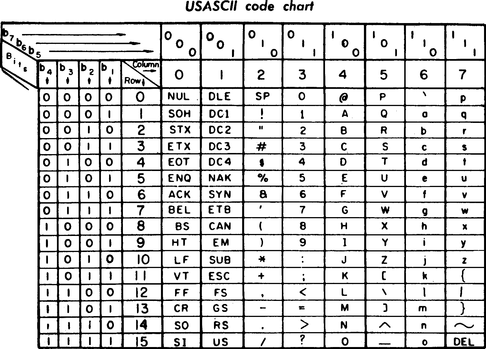
</p>

ASCII was developed from telegraph code. Its first commercial use was as a
seven-bit teleprinter code promoted by Bell data services. Originally based
on the English alphabet, ASCII encodes 128 specified characters into
seven-bit integers as shown by the ASCII chart above. The first edition of
the standard was published in 1963.

Extended ASCII (EASCII or high ASCII) character encodings are eight-bit
or larger encodings that include the standard seven-bit ASCII characters,
plus additional characters. There are many extended ASCII encodings.

The phrase "ANSI character set" has no well-defined meaning and in the
context of ANSI Art typically refers to "Code page 437", the character
set of the original IBM PC. In Asciiville the phrase "ANSI Art" refers
to ASCII Art that utilizes the extended ASCII character encoding with
the ability to render colored text. The phrase "ASCII Art" encompasses
all such character renderings, ASCII and extended ASCII. Whether it's
"Art" is left as an exercise for the viewer.

### ASCII Art History

The Asciiville Wiki article "[ASCII Art History](Ascii-Art-History)"
provides us with a brief history of the development of text based art over
the millenia, concrete poetry to typewriter art to ASCII and ANSI art.

<p float="left">
Typewriter art by Flora F.F. Stacey from 1898<br/>
  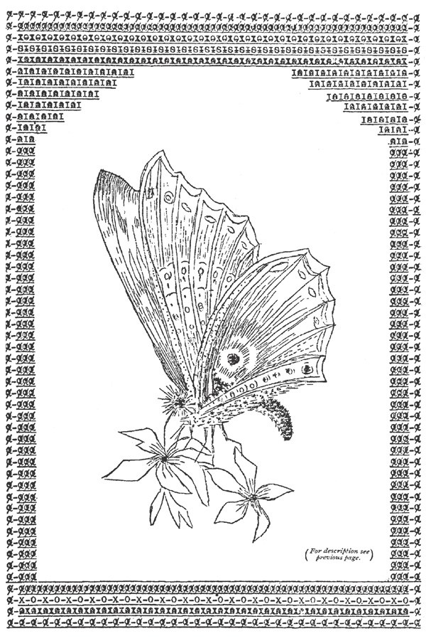
</p>

## Videos

Introduction to Asciiville Video:
[](https://www.youtube.com/watch?v=t5bfVqqDvI0 "Asciiville Introduction")

Asciiville Art Slideshow Video:
[](https://www.youtube.com/watch?v=HQPvfJGo4VA "Asciiville Art Slideshow")

Asciiville Space Slideshow Video:
[](https://www.youtube.com/watch?v=DZV69SYLvc4 "Asciiville Space Slideshow")

## Screenshots

<p float="left">
Asciiville Main Menu<br/>
  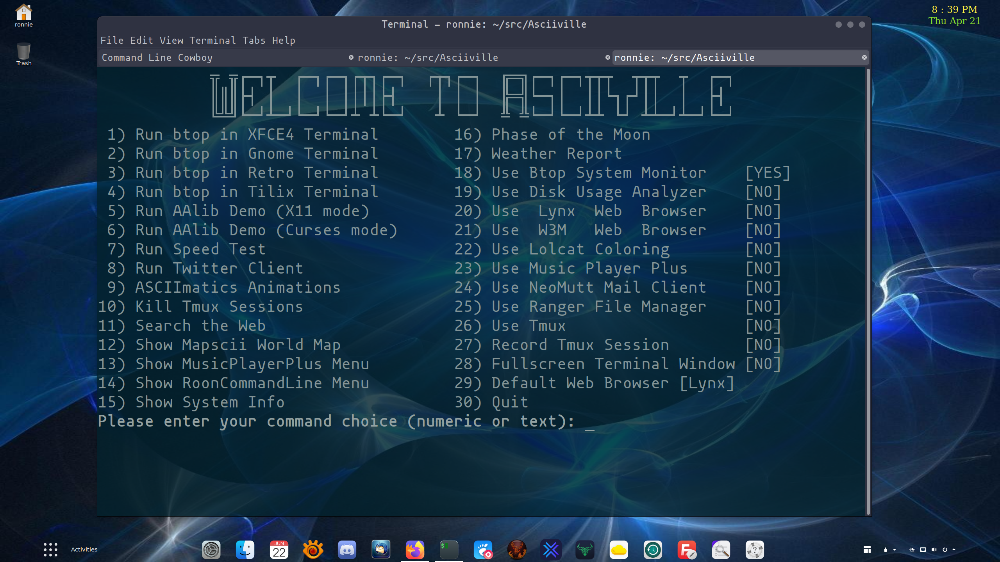
  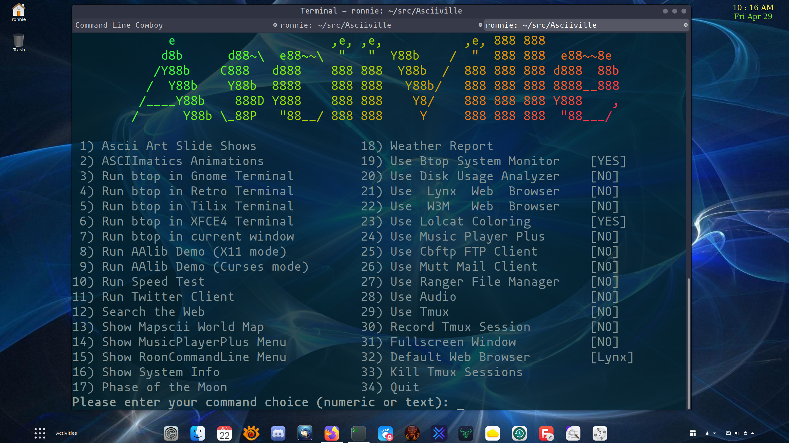
</p>

<p float="left">
Asciiville Sub-Menus: Ascii Art, Asciimatics Animations, MusicPlayerPlus, and RoonCommandLine<br/>
  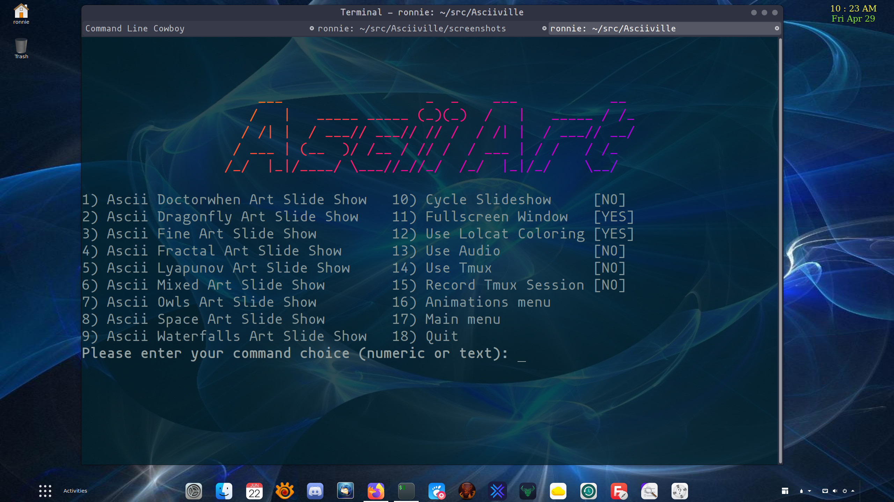
  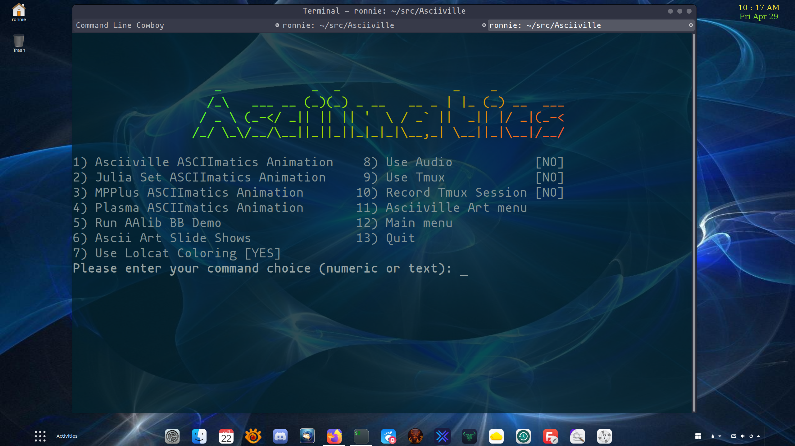
  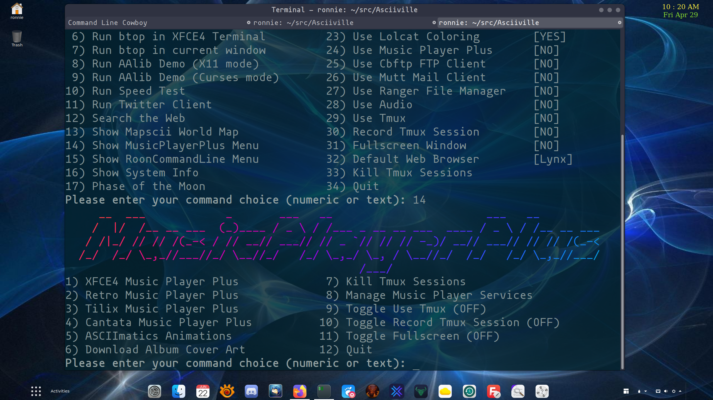
  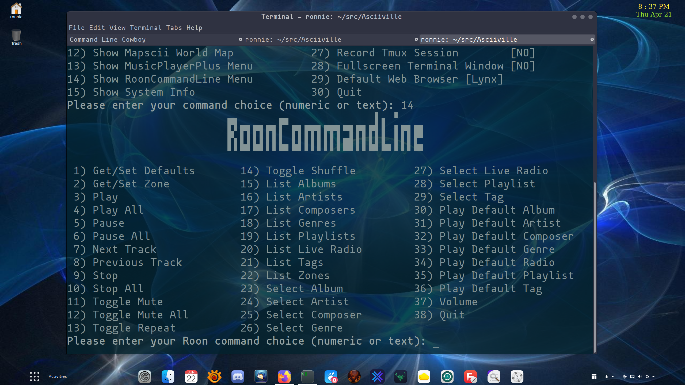
</p>

<p float="left">
Ascii System Monitor, Maps, and Weather<br/>
  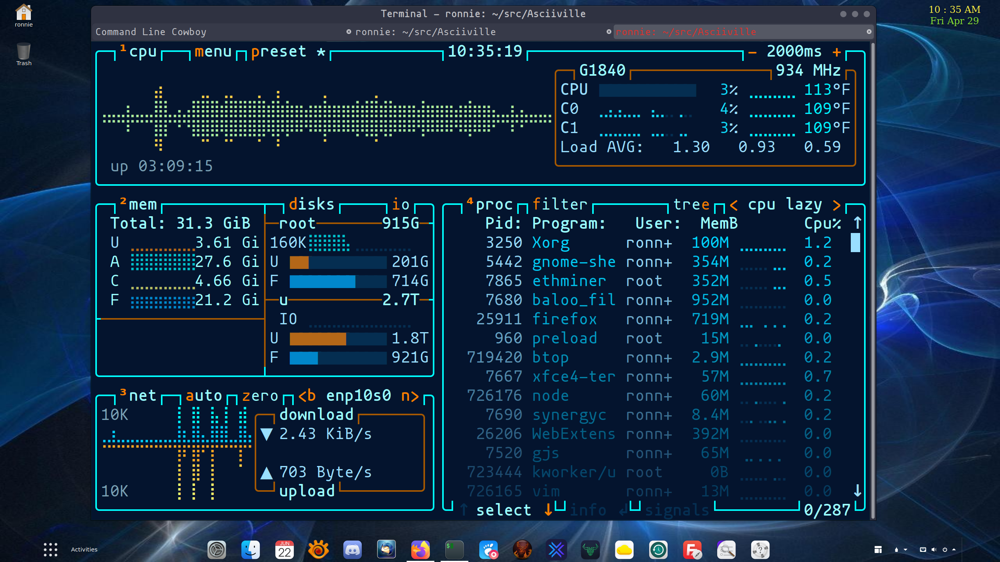
  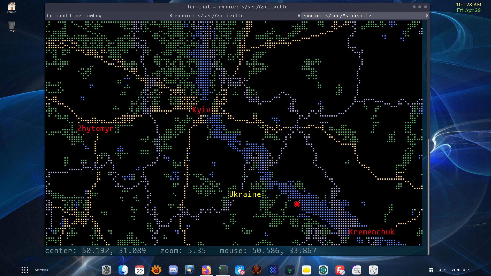
  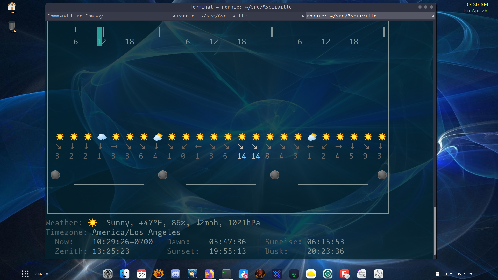
</p>

