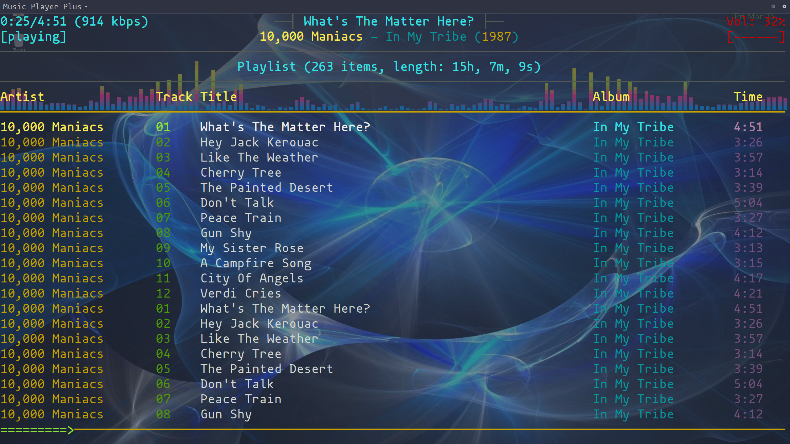

# MusicPlayerPlus

The MusicPlayerPlus project provides integration and extension of several
audio packages designed to stream and play music. MusicPlayerPlus interacts
with the Music Player Daemon (MPD). Outputs from the MPD streaming audio server
are used as MusicPlayerPlus inputs for playback and visualization. In addition,
MusicPlayerPlus components are used to manage, control, and update MPD.

## Table of contents

1. [Overview](#overview)
    1. [MusicPlayerPlus Commands](#musicplayerplus-commands)
    1. [Main mpcplus MPD client features](#main-mpcplus-mpd-client-features)
1. [Quickstart](#quickstart)
1. [Requirements](#requirements)
1. [Installation](#installation)
    1. [Debian package installation](#debian-package-installation)
    1. [RPM Package installation](#rpm-package-installation)
1. [Post Installation Configuration](#post-installation-configuration)
    1. [MPD Server Configuration](#mpd-server-configuration)
    1. [Client Configuration](#client-configuration)
    1. [Start MPD](#start-mpd)
    1. [Initialize Music Database](#initialize-music-database)
    1. [Terminal Emulator Profiles](#terminal-emulator-profiles)
    1. [Gnome Terminal Emulator Profile](#gnome-terminal-emulator-profile)
    1. [Tilix Terminal Emulator Profiles](#tilix-terminal-emulator-profiles)
1. [Documentation](#documentation)
    1. [README for mpcplus MPD client](#readme-for-mpcplus-mpd-client)
    1. [Man Pages](#man-pages)
    1. [Usage](#usage)
    1. [Example client invocations](#example-client-invocations)
    1. [Adding Album Cover Art](#adding-album-cover-art)
1. [Removal](#removal)
1. [Troubleshooting](#troubleshooting)
1. [Screenshots](#screenshots)
1. [Videos](#videos)

## Overview

MusicPlayerPlus integrations and extensions are primarily aimed at the
character based terminal user. They enable an easy to use seamlessly
integrated control of audio streaming, playing, and visualization in
a lightweight character based environment.

Audio streaming is provided by the Music Player Daemon (MPD).
At the core of MusicPlayerPlus is the `mpplus` command which acts as
a front-end for a variety of terminal and/or `tmux` sessions.

The `mpplus` command can be used to invoke:

* The lightweight character based MPD client, `mpcplus`
* One or more terminal emulators running an MPD client and visualizer
* A tmux session
* A spectrum visualizer
* Any MPD client the user wishes to run
* One of several asciimatics animations optionally accompanied by audio

Integration is provided for:

* [mpd](https://www.musicpd.org/), the Music Player Daemon
* [mpcplus](mpcplus/README.md), character based Music Player Plus MPD client
* [cantata](https://github.com/CDrummond/cantata), graphical MPD client
* [cava](https://github.com/karlstav/cava), an audio spectrum visualizer
* [mplayer](http://mplayerhq.hu/design7/info.html), a media player
* [asciimatics](https://github.com/peterbrittain/asciimatics) - automatically display a variety of character based animation effects
* [asciinema](https://asciinema.org/) - automatically create ascii character based video clips
* [tmux](https://github.com/tmux/tmux/wiki), a terminal multiplexer
* Enhanced key bindings for extended control of terminal windows
* Several terminal emulators
    * xfce4-terminal
    * gnome-terminal
    * tilix
    * cool-retro-term

### MusicPlayerPlus Commands

MusicPlayerPlus adds the following commands to your system:

* **mpplus** : primary user interface, invokes an MPD client, spectrum visualizer, and more
* **mpcplus** : Featureful NCurses MPD client, compiled with spectrum visualizer
* **mpcinit** : one-time initializaton of a user's mpcplus configuration
* **mpcplus-tmux** : runs mpcplus, a visualizer, and displays album art in a tmux session
* **mppsplash** : fun ascii art screens using ASCIImatics animations. Ascii art commands:
    * **asciijulia** : ASCIImatics animated zoom on a Julia Set
    * **asciiplasma** : ASCIImatics animated plasma graphic
    * **asciimpplus** : ASCIImatics animated MusicPlayerPlus splash screen
* **raise_cava** : raises the cava spectrum visualizer window
* **set_term_trans** : sets an xfce4-terminal window's transparency level
* **download_cover_art** : automatically downloads cover album art for your entire music directory

Additional detail and info can be found in the
[MusicPlayerPlus Wiki](https://github.com/doctorfree/MusicPlayerPlus/wiki).

### Main mpcplus MPD client features

* tag editor
* playlist editor
* easy to use search engine
* media library
* integration with external spectrum visualizer
* ability to fetch song lyrics from a variety of sources
* ability to fetch artist info from last.fm
* new display mode
* alternative user interface
* ability to browse and add files from outside of MPD music directory
* cute trick to add album cover art in character display using tmux

## Quickstart

* Install the latest Debian or RPM format installation package from the [MusicPlayerPlus Releases](https://github.com/doctorfree/MusicPlayerPlus/releases) page
* Edit `/etc/mpd.conf` and set the `music_directory` entry to the location of your music library (must be done with `sudo`, e.g. `sudo vi /etc/mpd.conf`)
* Run the `mpcinit` command (must be done as your normal user, no need for `sudo`)
* Verify the `mpd` service is running and if not then start it:
    * `systemctl status mpd`
    * `sudo systemctl start mpd`
* Update the MPD client database:
    * `mpplus` then type `u`
* Play music with `mpplus`
    * See the [online mpcpluskeys cheat sheet](https://github.com/doctorfree/MusicPlayerPlus/wiki/mpcpluskeys.1) or `man mpcpluskeys` for help navigating the `mpplus` windows
    * See the [online mpplus man page](https://github.com/doctorfree/MusicPlayerPlus/wiki/mpplus.1) or `man mpplus` for different ways to invoke the `mpplus` command

## Requirements

MusicPlayerPlus can be installed on Debian or RPM based Linux systems.
It requires:

* [MPD Music Player Daemon](https://www.musicpd.org/)
* [Cava](https://github.com/karlstav/cava)
* [Boost library](https://www.boost.org/)
* [NCurses library](http://www.gnu.org/software/ncurses/ncurses.html)
* [Readline library](https://tiswww.case.edu/php/chet/readline/rltop.html)
* [Curl library](https://curl.haxx.se/)
* [Bash](https://en.wikipedia.org/wiki/Bash_(Unix_shell))

These dependencies will all be automatically installed if not present
when MusicPlayerPlus is installed using the Debian or RPM packaging.

## Installation

MusicPlayerPlus v1.0.0 and later can be installed on Linux systems using
either the Debian packaging format or the Red Hat Package Manager (RPM).

### Debian package installation

Many Linux distributions, most notably Ubuntu and its derivatives, use the
Debian packaging system.

To tell if a Linux system is Debian based it is usually sufficient to
check for the existence of the file `/etc/debian_version` and/or examine the
contents of the file `/etc/os-release`.

To install on a Debian based Linux system, download the latest Debian format
package from the
[MusicPlayerPlus Releases](https://github.com/doctorfree/MusicPlayerPlus/releases).

Install the MusicPlayerPlus package by executing the command

```console
sudo apt install ./MusicPlayerPlus_<version>-<release>.amd64.deb
```
or
```console
sudo dpkg -i ./MusicPlayerPlus_<version>-<release>.amd64.deb
```

**NOTE:** In some cases you may see a warning message when installing the
Debian package. The message:

Repository is broken: musicplayerplus:amd64 (= <version-<release>) has no Size information

can safely be ignored. This is an issue with the Debian packaging system
and has no effect on the installation.

### RPM Package installation

Red Hat Linux, SUSE Linux, and their derivatives use the RPM packaging
format. RPM based Linux distributions include Fedora, AlmaLinux, CentOS,
openSUSE, OpenMandriva, Mandrake Linux, Red Hat Linux, and Oracle Linux.

To install on an RPM based Linux system, download the latest RPM format
package from the
[MusicPlayerPlus Releases](https://github.com/doctorfree/MusicPlayerPlus/releases).

Install the MusicPlayerPlus package by executing the command

```console
sudo yum localinstall ./MusicPlayerPlus_<version>-<release>.x86_64.rpm
```
or
```console
sudo rpm -i ./MusicPlayerPlus_<version>-<release>.x86_64.rpm
```

## Post Installation Configuration
After installing MusicPlayerPlus there are several recommended
configuration steps. If not already configured, the MPD server
will need to know where to locate your music library. This can
be configured by editing the MPD configuration file `/etc/mpd.conf`.
In addition, it is recommended to setup custom profiles in some
of the terminal emulators to enhance the spectrum visualization.

Minimal post installation configuration required is the configuration of
your music directory in `/etc/mpd.conf` and execution of the command `mpcinit`.

### MPD Server Configuration
Edit `/etc/mpd.conf`, uncomment the `music_directory` entry and
set the value to the location of your music library. For example,

```
music_directory		"/u/audio/Music"
```

Adjust the `audio_output` settings in `mpd.conf`. MPD must have at least
one `audio_output` configured and in order to use the spectrum visualizer
as configured by default it is necessary to configure a second `audio_output`
in MPD.

A FIFO `audio_output` is used as a data source for the Cava spectrum visualizer.
To configure this output, add the following to `/etc/mpd.conf`:

```
audio_output {
    type            "fifo"
    name            "Visualizer feed"
    path            "/tmp/mpd.fifo"
    format          "44100:16:2"
}
```

An example ALSA `audio_output` configuration in `/etc/mpd.conf`:

```
audio_output {
	type		"alsa"
	name		"My ALSA Device"
    buffer_time "50000"   # (50ms); default is 500000 microseconds (0.5s)
#	device		"hw:0,0"	# optional
#	mixer_type      "hardware"      # optional
#	mixer_device	"default"	# optional
#	mixer_control	"PCM"		# optional
#	mixer_index	"0"		# optional
}
```

Or, to use PulseAudio:

```
audio_output {  
    type  "pulse"  
    name  "pulse audio"
    device         "pulse" 
    mixer_type      "hardware" 
}  
```

MPD is a powerful and flexible music player server with many configuration
options. Additional MPD configuration may be desired. See the
[MPD User's Manual](https://mpd.readthedocs.io/en/stable/user.html)

### Client Configuration
After configuring the MPD music_directory in `/etc/mpd.conf`, initialize
the `mpcplus` client configuration by executing the command:

```
mpcinit
```

Examine the generated `mpcplus` configuration in `~/.config/mpcplus/config`
and `~/.config/mpcplus/bindings` and make any desired changes.

While the MPD Server configuration changes above are system-wide,
the Client configuration performed by `mpcinit` is per-user.
Each user needs to perform this step as well as the creation of
terminal profiles described below.

### Start MPD

If this is a fresh installation of MPD, start mpd by executing the command:

`sudo systemctl start mpd`

If you want MPD to start automatically on subsequent reboots, run:

`sudo systemctl enable mpd`

And if you want MPD to start automatically when a client tries to connect:

`sudo systemctl enable mpd.socket`

### Initialize Music Database
To initialize the music database, after configuring MPD as described above,
launch an MPD client and update the database. The `mpcplus` MPD client can
be used for this or the standard `mpc` MPD client can be used.

After launching the MPD client make sure the MPD client window has focus
and type `u`. This should trigger a database update. If your music library
is large this process can take several minutes to complete. Once the music
database has been updated you should see the songs, albums, and playlists
in your music library appear in the MPD client view.

### Terminal Emulator Profiles
The Cava spectrum visualizer looks better when the font used by the
terminal emulator in which it is running is a small sized font. Some
terminal emulators rely on a profile from which they draw much of
their configuration. Profiles are used in MusicPlayerPlus to provide
an enhanced visual presentation. To configure terminal emulator profiles
launch the desired terminal emulator and create a new profile in the
Preferences dialog.

There are three terminal profiles in two terminal emulators used by
MusicPlayerPlus. The `gnome-terminal` emulator has a single profile
called "SmallFont" and the `tilix` terminal emulator has two profiles
called "Cava" and "MusicPlayer". To create these profiles:

### Gnome Terminal Emulator Profile
Launch `gnome-terminal`, click the `...` three dots in the Title Bar
and then click `Preferences` in the dropdown menu. This will bring up
a Preferences dialog window. Next to the `Profiles` entry on the left,
click the `+` plus sign to add a new profile. Name the profile "SmallFont".

Under `Profiles` on the left side of the Preferences window, click on
your new profile "SmallFont". In the `Text` tab of the "SmallFont" profile,
check `Custom font` and select a font. Set the size of the font to 8 or
smaller. A very small font size, say 1, may cause performance issues on
large visualizer windows.

While still in the "SmallFont" profile configuration dialog, click the
`Colors` tab. Check `Use transparent background` and adjust the slider
to halfway full. You may need to revisit this dialog to adjust the
transparency level to suit your display and preference.

I also disable the scroll bar in the `Scrolling` tab by unchecking
`Show scrollbar` but this is optional. Scrolling is not likely to be
needed in the spectrum visualizer window.

### Tilix Terminal Emulator Profiles
Launch `tilix`, click the `...` three dots in the Title Bar
and then click `Preferences` in the dropdown menu. This will bring up
a Preferences dialog window. At the lower left of the left pane,
click the `+` plus sign to add a new profile. Name the profile "Cava".

In the `General` tab of the "Cava" profile, check `Custom font` and
select a font. Set the size of the font to 8 or smaller. A very small
font size, say 1, may cause performance issues on large visualizer windows.

While still in the "Cava" profile configuration dialog, click the
`Colors` tab. Adjust the `Transparency` slider to halfway full.
You may need to revisit this dialog to adjust the transparency level
to suit your display and preference.

I also disable the scroll bar in the `Scrolling` tab by unchecking
`Show scrollbar` but this is optional. Scrolling is not likely to be
needed in the spectrum visualizer window.

Tilix is also used as the MPD client window for character based clients.
An additional terminal profile is needed for this. Repeat the process
described above to create the `Cava` tilix profile only this time create
a new profile named `MusicPlayer`. The `MusicPlayer` tilix profile creation
is exactly the same as the `Cava` profile creation but the name of the
profile is different and the size of the font is different. Name the new
profile `MusicPlayer` and set the font size to something like 32. You may
need to adjust the font size subsequently. On my system, a music player
client window with font size 32 aligns nicely with a spectrum visualizer
window with font size 8. This will vary depending on your display device.

Also set the transparency level for the `MusicPlayer` profile just as you
did for the `Cava` profile, somewhere around half transparent in the `Color`
tab of the profile config dialog.

## Documentation

All MusicPlayerPlus commands have manual pages. Execute `man <command-name>`
to view the manual page for a command. The `mpplus` frontend is the primary
user interface for MusicPlayerPlus and the manual page for `mpplus` can be
viewed with the command `man mpplus`. Most commands also have
help/usage messages that can be viewed with the **-u** argument option,
e.g. `mpplus -u`.

### README for mpcplus MPD client
- [**mpcplus/README.md**](mpcplus/README.md) - Introduction to the mpcplus MPD client

### Man Pages

- [**mpplus**](markdown/mpplus.1.md) : Primary MusicPlayerPlus user interface
- [**asciijulia**](markdown/asciijulia.1.md) : asciimatics animation of a Julia Set
- [**asciimpplus**](markdown/asciimpplus.1.md) : asciimatics animation of MusicPlayerPlus intro
- [**asciiplasma**](markdown/asciiplasma.1.md) : asciimatics animation with Plasma effect
- [**mpcinit**](markdown/mpcinit.1.md) : MusicPlayerPlus initialization
- [**mpcplus-tmux**](markdown/mpcplus-tmux.1.md) : MusicPlayerPlus in a tmux session
- [**mpcplus**](markdown/mpcplus.1.md) : MusicPlayerPlus MPD client
- [**mpcpluskeys**](markdown/mpcpluskeys.1.md) : Cheat sheet for `mpcplus` MPD client navigation
- [**mppsplash-tmux**](markdown/mppsplash-tmux.1.md) : MusicPlayerPlus asciimatics animations in a tmux session
- [**mppsplash**](markdown/mppsplash.1.md) : MusicPlayerPlus asciimatics animations

### Usage

The usage messages for `mpplus`, `mpcplus`, and `cava` provide a brief
summary of the command line options:

```
Usage: mpplus [-A] [-a] [-b] [-c] [-C client] [-D] [-d music_directory]
		[-f] [-h] [-i] [-jJ] [-k] [-m]
		[-M alsaconf|enable|disable|restart|start|stop|status]
		[-n num] [-N] [-p] [-P script] [-q]
		[-r] [-R] [-s song] [-S] [-t] [-T] [-u]
MPCplus/Visualizer options:
	-A indicates display album cover art (implies tmux session)
	-c indicates use cantata MPD client rather than mpcplus
	-C 'client' indicates use 'client' MPD client rather than mpcplus
	-f indicates fullscreen display
	-i indicates start mpplus in interactive mode
	-h indicates half-height for cava window (with -f only)
	-P script specifies the ASCIImatics script to run in visualizer pane
	-q indicates quarter-height for cava window (with -f only)
	-r indicates use retro terminal emulator
	-t indicates use tilix terminal emulator
ASCIImatics animation options:
	-a indicates play audio during ASCIImatics display
	-b indicates use backup audio during ASCIImatics display
	-j indicates use Julia Set scenes in ASCIImatics display
	-J indicates Julia Set with several runs using different parameters
	-m indicates use MusicPlayerPlus scenes in ASCIImatics display
	-n num specifies the number of times to cycle ASCIImatics scenes
	-N indicates use alternate comments in Plasma ASCIImatics scenes
	-p indicates use Plasma scenes in ASCIImatics display
	-s song specifies a song to accompany an ASCIImatics animation
		'song' can be the full pathname to an audio file or a
		relative pathname to an audio file in the MPD music library
		or /home/ronnie/Music/
	-S indicates display ASCIImatics splash animation
General options:
	-D indicates download album cover art
	-d 'music_directory' specifies the music directory to use for
		downloaded album cover art (without this option -D will use
		the 'music_directory' setting in '/etc/mpd.conf'
	-k indicates kill MusicPlayerPlus tmux sessions and ASCIImatics scripts
	-M 'action' can be used to control the Music Player Daemon (MPD)
	    or configure the ALSA sound system
		MPD actions will be applied to both the MPD service
		and the MPD socket service while ALSA configuration
		will update the ALSA configuration in '/etc/asound.conf'
	-R indicates record tmux session with asciinema
	-T indicates use a tmux session for either ASCIImatics or mpcplus
	-u displays this usage message and exits
```

```
Usage: mpcplus [options]...
Options:
  -h [ --host ] HOST (=localhost)       connect to server at host
  -p [ --port ] PORT (=6600)            connect to server at port
  --current-song [=FORMAT(={{{(%l) }{{%a - }%t}}|{%f}})]
                                        print current song using given format 
                                        and exit
  -c [ --config ] PATH (=~/.config/mpcplus/config AND ~/.mpcplus/config)
                                        specify configuration file(s)
  --ignore-config-errors                ignore unknown and invalid options in 
                                        configuration files
  --test-lyrics-fetchers                check if lyrics fetchers work
  -b [ --bindings ] PATH (=~/.config/mpcplus/bindings AND ~/.mpcplus/bindings)
                                        specify bindings file(s)
  -s [ --screen ] SCREEN                specify the startup screen
  -S [ --slave-screen ] SCREEN          specify the startup slave screen
  -? [ --help ]                         show help message
  -v [ --version ]                      display version information
  -q [ --quiet ]                        suppress logs and excess output
```

The mpcplus MPD client has an extensive set of key bindings that allow
quick and easy control of MPD, searches, lyrics display, client navigation,
and much more via the keyboard. View the
[**mpcpluskeys man page**](markdown/mpcpluskeys.1.md) with the command
`man mpcpluskeys`.

```
Usage: mppsplash [-A] [-a] [-b] [-C] [-c num] [-d] [-jJ] [-m] [-p] [-s song] [-u]
Where:
	-A indicates use all effects
	-a indicates play audio during ASCIImatics display
	-b indicates use backup audio during ASCIImatics display
	-C indicates use alternate comments in Plasma effect
	-c num specifies the number of times to cycle
	-d indicates enable debug mode
	-j indicates use Julia Set effect
	-J indicates Julia Set with several runs using different parameters
	-m indicates use MusicPlayerPlus effect
	-p indicates use Plasma effect
	-s song specifies the audio file to play as accompaniment
		'song' can be the full pathname to an audio file or a relative
		pathname to an audio file in the MPD music library or
		$HOME/Music/
	-u displays this usage message and exits
```

```
Usage : cava [options]
Visualize audio input in terminal. 

Options:
    -p          path to config file
    -v          print version

Keys:
        Up        Increase sensitivity
        Down      Decrease sensitivity
        Left      Decrease number of bars
        Right     Increase number of bars
        r         Reload config
        c         Reload colors only
        f         Cycle foreground color
        b         Cycle background color
        q         Quit

All options are specified in a config file. See `/home/username/.config/cava/`
```

### Example client invocations
The `mpplus` command is intended to serve as the primary interface to invoke
the `mpcplus` MPD client and `cava` spectrum visualizer. The `mpplus` command
utilizes several different terminal emulators and can also be used to invoke
any specified MPD client. Some example invocations of `mpplus` follow.

Open the mpcplus client and cava visualizer in fullscreen mode. The client
will open in the xfce4-terminal emulator and the visualizer in gnome-terminal:

`mpplus -f`

Open the mpcplus client and cava visualizer in fullscreen mode using the
tilix terminal emulator and displaying the visualizer using quarter-height:

`mpplus -f -q -t`

Open the cantata MPD graphical client and cava visualizer:

`mpplus -c`

Open the mpcplus client in the cool-retro-term terminal and cava visualizer
in gnome-terminal:

`mpplus -r`

The mpcplus MPD client can be opened directly without using mpplus.
Similarly, the cava spectrum visualizer can be opened directly without mpplus.

`mpcplus` # In one terminal window

`cava`    # In another terminal window

To test the mpcplus lyrics fetchers:

`mpcplus --test-lyrics-fetchers`

### Adding Album Cover Art
The `mpcplus` MPD client is a character based application. As such, it is
difficult to display graphical images. However, this limitation can be
overcome using `tmux` and additional tools. In this way we can add album
cover art to MusicPlayerPlus when using the character based `mpcplus` client.

See [Adding album art to MusicPlayerPlus](with-cover-art/README.md) to get
started integrating album art in MusicPlayerPlus.

An album cover art downloader is included in MusicPlayerPlus. To download
cover art for all of the albums in your MPD music directory, run the command:

```
download_cover_art
```

or, alternately,

```
mpplus -d
```

Cover art for each album is saved as the file `cover.jpg` in the album folder.
Existing cover art is preserved.

## Removal

On Debian based Linux systems where the MusicPlayerPlus package was installed
using the MusicPlayerPlus Debian format package, remove the MusicPlayerPlus
package by executing the command:

```console
    sudo apt remove musicplayerplus
```
or
```console
    sudo dpkg -r musicplayerplus
```

On RPM based Linux systems where the MusicPlayerPlus package was installed
using the MusicPlayerPlus RPM format package, remove the MusicPlayerPlus
package by executing the command:

```console
    sudo yum remove MusicPlayerPlus
```
or
```console
    sudo rpm -e MusicPlayerPlus
```

The MusicPlayerPlus package can be removed by executing the "Uninstall"
script in the MusicPlayerPlus source directory:

```console
    git clone git@github.com:doctorfree/MusicPlayerPlus.git
    cd MusicPlayerPlus
    ./Uninstall
```

## Troubleshooting
Many problems encountered with MusicPlayerPlus often resolve to problems with
the underlying Linux audio configuration. As a first step in troubleshooting,
verify the audio subsystem is functioning properly. Most systems use either
ALSA or PulseAudio and there are numerous audio test guides available.

MusicPlayerPlus includes a convenience script to test the ALSA audio subsystem.
The command `alsa_audio_test` can be run to test your ALSA audio setup.
If successful you will hear the test output of the `aplay` command.
To view a `alsa_audio_test` usage message and current ALSA configuration
settings, run the command `alsa_audio_test -u`

Another source of problems to investigate is the Music Player Daemon (MPD).
This is the music streaming server that MusicPlayerPlus connects to. MPD
is run as a system service that runs automatically. You can check the status
of the MPD service by running the command `systemctl status mpd`. You can
restart the MPD service with `sudo systemctl restart mpd`. If the issue is
not resolved by a restart or reboot, check the MPD log file at
`/var/log/mpd/mpd.log` looking for recent failures and exceptions.

It may be the case that the root of a problem is a missing dependency.
MusicPlayerPlus should have installed any missing dependencies but one
may have been overlooked, improperly installed, or subsequently removed.
If the system logs or error output indicates something was "not found"
then check for its existence. On Debian based systems there is a nice
repository package index maintained. If a command was not found, it is
often possible to simply type that command at a shell prompt and the
Debian packaging system will be searched for any packages that contain
a command with that name. If a likely looking package is returned, the
problem may be solved by installing that package.

Finally, see the Troubleshooting section of the
[MusicPlayerPlus Wiki](https://github.com/doctorfree/MusicPlayerPlus/wiki).
for additional troubleshooting techniques and commonly resolved issues.

If an issue cannot be resolved and all troubleshooting efforts have
failed, open an issue at
[MusicPlayerPlus issues](https://github.com/doctorfree/MusicPlayerPlus/issues).
Even if you do manage to resolve an issue, it may still be helpful to
report the issue at https://github.com/doctorfree/MusicPlayerPlus/issues
so that a fix may be incorporated in the next release.

## Screenshots

<p float="left">
  
  
</p>

## Videos

- [](https://www.youtube.com/watch?v=r7XLA9tO45Q "MusicPlayerPlus ASCIImatics Intro")
- [](https://www.youtube.com/watch?v=y2yaHm04ELM "MusicPlayerPlus Demo")
