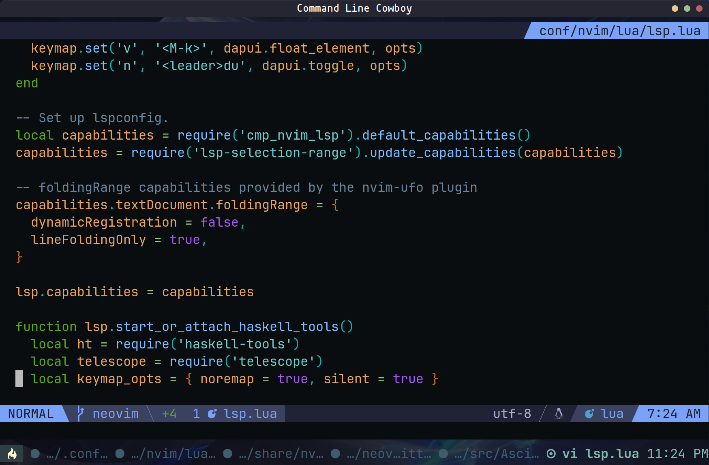
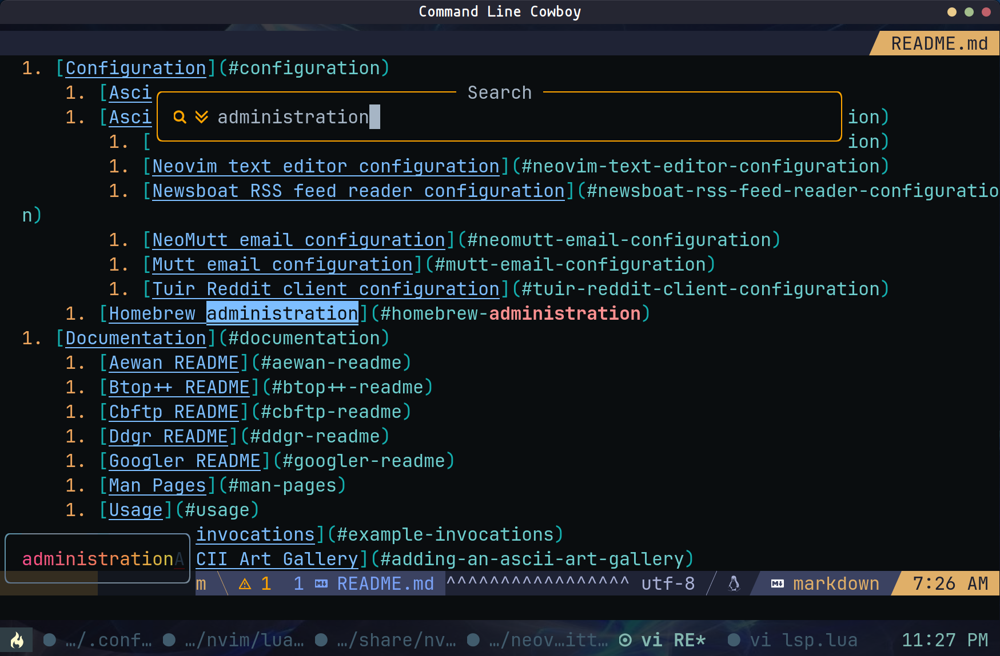
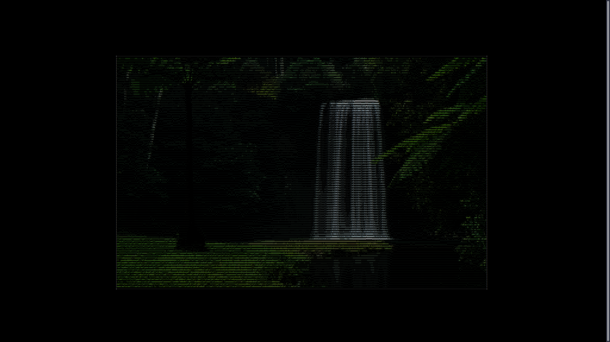

<div align="center"><p>
  
</p></div>

Asciiville is where you go for ASCII Art, animations, and utilities.
The Asciiville project provides integration and extension of several
packages as well as providing convenience commands to invoke a variety
of components used to display ASCII Art, animations, and text based
utilities to perform common operations in a text-only environment.

Asciiville includes nearly 1,000 works of ASCII and ANSI Art!

Asciiville is one of the [Neoman](https://neoman.dev) managed projects:

| **Neoman** | **Managed** | **Projects** |
| ---------- | ----------- | ------------ |
| [Asciiville](https://asciiville.dev) | [Lazyman](https://lazyman.dev) | [MirrorCommand](https://mirrorcommand.dev) |
| [MusicPlayerPlus](https://musicplayerplus.dev) | [Neoman](https://neoman.dev) | [RoonCommandLine](https://rooncommand.dev) |

## Table of Contents

1. [Overview](#overview)
1. [Asciiville Ascii Art Galleries](#asciiville-ascii-art-galleries)
1. [Asciiville Commands](#asciiville-commands)
1. [Quickstart](#quickstart)
1. [Requirements](#requirements)
1. [Installation](#installation)
    1. [Arch Linux package installation](#arch-linux-package-installation)
    1. [Debian package installation](#debian-package-installation)
    1. [RPM package installation](#rpm-package-installation)
    1. [Manual installation](#manual-installation)
    1. [BB AAlib Demo](#bb-aalib-demo)
1. [Configuration](#configuration)
    1. [Asciiville configuration](#asciiville-configuration)
    1. [Asciiville utilities configuration](#asciiville-utilities-configuration)
        1. [Kitty SSH terminfo configuration](#kitty-ssh-terminfo-configuration)
        1. [Neovim text editor configuration](#neovim-text-editor-configuration)
        1. [Newsboat RSS feed reader configuration](#newsboat-rss-feed-reader-configuration)
        1. [NeoMutt email configuration](#neomutt-email-configuration)
        1. [Mutt email configuration](#mutt-email-configuration)
        1. [Tuir Reddit client configuration](#tuir-reddit-client-configuration)
    1. [Homebrew administration](#homebrew-administration)
1. [Documentation](#documentation)
    1. [Aewan README](#aewan-readme)
    1. [Btop++ README](#btop++-readme)
    1. [Cbftp README](#cbftp-readme)
    1. [Ddgr README](#ddgr-readme)
    1. [Googler README](#googler-readme)
    1. [Man Pages](#man-pages)
    1. [Usage](#usage)
    1. [Example invocations](#example-invocations)
1. [Adding an ASCII Art Gallery](#adding-an-ascii-art-gallery)
    1. [Generating ASCII Art](#generating-ascii-art)
    1. [Adding and Viewing Art Galleries](#adding-and-viewing-art-galleries)
    1. [ASCII Art Tools](#ascii-art-tools)
    1. [ASCII Art Online](#ascii-art-online)
1. [Figlet fonts](#figlet-fonts)
1. [Build](#build)
1. [Removal](#removal)
1. [What is ASCII](#what-is-ascii)
    1. [ASCII Art History](#ascii-art-history)
1. [Videos](#videos)
1. [Screenshots](#screenshots)
1. [Contributing](#contributing)
    1. [Testing and Issue Reporting](#testing-and-Issue-Reporting)
    1. [Sponsor Asciiville](#sponsor-asciiville)
    1. [Contribute to Development](#contribute-to-development)
1. [Connect](#connect)

## Overview

Asciiville integrations and extensions are aimed at the character
based terminal and console user. They enable easy to use seamlessly
integrated control of a variety of ASCII Art, animation, and utilities
in a lightweight character based environment.

At the core of Asciiville is the `asciiville` command which acts as
a front-end for a variety of terminal commands and `tmux` sessions.

The `asciiville` command can be used to display Ascii Art either
as a slideshow or interactively. For example:

```console
# Slideshow of Ascii Art in /usr/share/asciiville/art/Art/
asciiville -V Art
# Slideshow of Ascii Art in /usr/share/asciiville/art/Vintage/
asciiville -V Vintage
# Interactive display of Ascii Art in .../file1 and .../file2
asciiville file1 file2 ...
# Slideshow of Ascii Art in file1, file2, and file3
asciiville -V files file1 file2 file3
# Slideshow of Ascii Art files listed in /tmp/asciiart.txt
asciiville -V files=/tmp/asciiart.txt
```

Filenames provided to `asciiville`, either on the command line or in
a specified file, can be absolute paths to files; relative paths to files;
or relative paths to files in the Asciiville Ascii Art galleries folder.
Ascii Art filenames may be provided with or without the filename suffix
(e.g. `Friends/tux.asc` or `Friends/tux.asc.gz` or `Friends/tux`).

When viewing Ascii Art in display mode it is possible to enter 'browse/zoom'
mode by entering 'b' or 'z' at the keyboard. In this mode the currently
displayed art can be zoomed in and out. See the [Usage](#usage) section below.

The `asciiville` command can also be used to invoke commands in a variety of ways:

* The lightweight character based system monitor, `btop`
* The lightweight character based web browser, `w3m`
* The lightweight character based mail client, `neomutt`
* The lightweight character based RSS feed reader, `newsboat`
* The lightweight character based FTP client, `cbftp`
* The lightweight character based music player, `mpcplus`
* The lightweight character based file manager, `ranger`
* The lightweight character based disk usage analyzer, `gdu`
* The lightweight character based journal app, `jrnl`
* The lightweight character based terminal UI for Reddit, `tuir`
* Featureful ASCII Art display including slideshow and zoom capabilities
* Character based ASCII Art and image to ascii conversion utility `jp2a`
* One or more terminal emulators running a command
* A tmux session
* A command line web search
* A zoomable map of the world
* Command line character based Twitter client
* Translate words and phrases from and to a wide variety of languages
* A network download/upload speed test
* The AAlib BB demo running in a tmux session (Debian based systems only)
* The ASCII text-based dungeon game `nethack` with Extended ASCII glyphs
* The `cmatrix` command that displays the screen from "The Matrix"
* Many text based applications and games
* ASCII Art creation tool `aewan`
* Display system info
* Display a random Pokemon
* Display the Phase of the Moon
* Display a weather report
* Display the MusicPlayerPlus or RoonCommandLine interactive menus
* Any character based client the user wishes to run
* Several asciimatics animations optionally accompanied by audio

Without arguments or with the `-i` argument, `asciiville` presents a set
of interactive menus that can be used to control its behavior.

Integration is provided for:

* [aewan](https://github.com/doctorfree/asciiville-aewan#readme), Ascii Art creation tool
* [btop](https://github.com/doctorfree/btop#readme), character based system monitor
* [cbftp](https://github.com/doctorfree/cbftp#readme), character based FTP client
* [ddgr](https://github.com/jarun/ddgr#readme), command line web search using DuckDuckGo
* [googler](https://github.com/jarun/googler#readme), command line web search using Google
* [jrnl](https://jrnl.sh/en/stable/), a simple command line journal application
* [khard](https://github.com/lucc/khard), address book for the Unix console
* [w3m](http://w3m.sourceforge.net/), another character based web browser
* [lynx](https://lynx.invisible-island.net/), character based web browser
* [mutt](http://www.mutt.org/), character based email client
* [neomutt](http://neomutt.org/), character based email client
* [neovim](https://neovim.io/), advanced open source screen-based text editor
* [newsboat](https://github.com/newsboat/newsboat), character based RSS feed reader
* [ranger](https://ranger.github.io/), character based file manager
* [tuir](https://gitlab.com/ajak/tuir/), terminal UI for Reddit
* [gdu](https://github.com/dundee/gdu#readme), character based disk usage analyzer
* [got](https://github.com/fedeztk/got), text based translation tool
* [mpcplus](https://github.com/doctorfree/MusicPlayerPlus/blob/master/mpcplus/README.md), featureful ncurses based Music Player client
* [mplayer](http://mplayerhq.hu/design7/info.html), a media player
* [asciimatics](https://github.com/peterbrittain/asciimatics) - automatically display a variety of character based animation effects
* [asciinema](https://asciinema.org/) - automatically create ascii character based video clips
* [rainbowstream](https://github.com/orakaro/rainbowstream) - command line character based Twitter client
    * See [the rainbowstream usage manual](https://rainbowstream.readthedocs.io/en/latest/#usage) to get started
* [endoh1](https://github.com/mame/winner/tree/main/2012/endoh1), ascii fluid dynamics simulation
* [mapscii](https://github.com/rastapasta/mapscii#readme), zoomable map of the world
* [cmatrix](https://github.com/abishekvashok/cmatrix), screen from "The Matrix"
* [nethack](https://en.wikipedia.org/wiki/NetHack), ASCII text dungeon game
* [ninvaders](https://en.wikipedia.org/wiki/Space_Invaders), ASCII text version of Space Invaders
* [tetris](https://en.wikipedia.org/wiki/Tetris), ASCII text version of Tetris
* [tmux](https://github.com/tmux/tmux/wiki), a terminal multiplexer
* [wttr.in](https://github.com/chubin/wttr.in), console-oriented weather report
* Enhanced key bindings for extended control of terminal windows
* Support for several terminal emulators
    * xfce4-terminal
    * gnome-terminal
    * kitty
    * tilix
    * cool-retro-term
* [MusicPlayerPlus](https://github.com/doctorfree/MusicPlayerPlus#readme), character based suite of commands to manage music server and player
* [RoonCommandLine](https://github.com/doctorfree/RoonCommandLine#readme), command line control of the Roon audio system over a local network

## Asciiville Ascii Art Galleries

The Asciiville project includes many curated Ascii Art galleries.
These include hundreds of high resolution Ascii Art files created
by Asciiville author and artist, Dr. Ronald Joe Record. The Asciiville
package, when installed, provides the following Ascii Art galleries
located in the default Ascii Art Gallery folder `/usr/share/asciiville/art/`:

```
Art - A collection of fine art transformed into Ascii Art
Doctorwhen - Some of Doctor When's fantastic art
Dragonflies - Photos of dragonflies converted to Ascii using Asciiville tools
Fractals - Images of fractals converted to Ascii using Asciiville tools
Friends - Photos of friends and family converted to Ascii using Asciiville tools
Iterated - Images made with iteration converted to Ascii using Asciiville tools
Lyapunov - Lyapunov fractals converted to Ascii using Asciiville tools
Nature - Photos of nature converted to Ascii using Asciiville tools
Owls - Photos of owls converted to Ascii using Asciiville tools
Space - Photos of space converted to Ascii using Asciiville tools
Vintage - Traditional Ascii Art
Wallpapers - Pretty wallpapers converted to Ascii using Asciiville tools
Waterfalls - Photos of waterfalls converted to Ascii using Asciiville tools
```

All of these galleries may be viewed using the menus in the `asciiville`
command. Asciiville users can add their own custom galleries using the
conversion and generation tools provided by Asciiville. Custom menus added
to the Ascii Art Gallery folder will automatically appear in the
`asciiville` menu selections.

Beginning with Asciiville version 1.4.0 release 2, Asciiville will ship with
gzip compressed ascii art gallery files. If you wish to compress your current
pre-1.4.0r2 Asciiville ascii art gallery files then download and install
[show_ascii_art](https://github.com/doctorfree/Asciiville/blob/main/bin/show_ascii_art).
Install the updated `show_ascii_art` by copying it to `/usr/bin/` with the
command `sudo cp show_ascii_art /usr/bin`.

When creating custom ascii art galleries for use with Asciiville, compression
is optional but can be used to reduce the disk size of ascii art files.  When
choosing to compress ascii art files, a gallery's files must be compressed
with `gzip`:

```console
cd /path/to/gallery
sudo gzip *.asc
```

## Asciiville Commands

Asciiville adds the following commands to your system:

* **asciiville** : primary user interface, invokes terminal emulators, ascii animations, system monitor, mail client, file manager, web browser, and more
* **aewan/aecat/aemakeflic** : Ascii Art creation tools
* **btop** : character based system monitor
* **cbftp** : character based FTP client
* **ascinit** : one-time initializaton of a user's Asciiville configuration
* **asciibrow** : browse the web in character mode
* **asciisplash** : fun ascii art screens using ASCIImatics animations. Ascii art commands:
    * **asciiart** : ASCIImatics animated art images
    * **asciijulia** : ASCIImatics animated zoom on a Julia Set
    * **asciiplasma** : ASCIImatics animated plasma graphic
    * **asciimpplus** : ASCIImatics animated Music Player Plus splash screen
* **datafilecat** : decrypts the content of a cbftp data file
* **datafilewrite** : encrypts the content of a cbftp plain text data file
* **ddgr** : command line web search using DuckDuckGo
* **googler** : command line web search using Google
* **gameserver** : multi-player game server
* **got** : text based translation tool
* **gum** : a tool for glamorous shell scripts
* **vhs** : script a terminal session and save it as a GIF
* **any2a** : any image format to ascii conversion utility
* **jp2a** : jpg/png image to ascii conversion utility
* **make_ascii_art** : generate ascii art from images
* **mapscii** : character based zoomable map of the world
* **nethack** : character based dungeon game
* **ninvaders** : classic video game
* **rainbowstream** : command line Twitter client
* **set_xfce_font** : sets an xfce4-terminal window's font and font size
* **set_xfce_trans** : sets an xfce4-terminal window's transparency level
* **show_ascii_art** : display ascii art, convert images to ascii art
* **show_endo** : display a series of ascii fluid dynamics simulations
* **show_pokemon** : display a Pokemon pocket monster
* **show_moon** : display the phase of the Moon
* **show_weather** : display a weather report
* **tdraw** : ASCII drawing tool
* **term-image** : Display and browse images in the terminal
* **termprofset** : set/restore default profile or font settings for the Gnome, Xfce4, and Tilix terminals
* **tetris** : classic video game

In addition to the above commands which reside in the Asciiville project,
several commands may also be installed as dependencies. These include:

* **asciinema** : ascii animation
* **bb** : AAlib demo animation
* **cmatrix** : display that screen from "The Matrix"
* **figlet** : display Figlet Text
* **gnupg** : pretty good privacy
* **ImageMagick** : the ImageMagick suite of graphics command line tools
* **jq** : json parsing and manipulation tool
* **khard** : contact management for the console
* **mplayer** : media player
* **neofetch** : system info
* **neomutt** : sophisticated text-based EMail and NNTP client
* **nvim** : neovim, an extensible screen-based text editor
* **newsboat** : text-based RSS feed reader
* **ranger** : text-based file management
* **speedtest-cli** : text-based command line network speed test
* **tmux** : embed commands and terminal sessions in a terminal multiplexer
* **urlscan** : scan for urls in a message
* **w3m** : text-based web browser

The Kitty terminal emulator is installed during `ascinit`. Several other
terminal emulators art optionally installed during `ascinit` unless
initialization is performed with `ascinit -c` or `ascinit -N`. The optional
terminal emulators are:

* **cool-retro-term**
* **gnome-terminal**
* **tilix** :
* **xfce4-terminal**

Additional detail and info can be found in the
[Asciiville Wiki](https://github.com/doctorfree/Asciiville/wiki).

## Quickstart

* Install the latest Arch, Debian, macOS, RPM, or compressed tar archive format installation package from the [Asciiville Releases](https://github.com/doctorfree/Asciiville/releases) page
* Run the `ascinit` command
    * Must be done as a normal user with `sudo` privilege
	* Run `ascinit -c` to perform a console initialization (no graphical utilities)
* Initialize the command line Twitter client by invoking the `rainbowstream` command and authorizing the app to access your Twitter account
* Execute the `asciiville` command in interactive menu mode by running `asciiville -i`
* See the [online asciiville man page](https://github.com/doctorfree/Asciiville/wiki/asciiville.1) or `man asciiville` for different ways to invoke the `asciiville` command

The `asciiville` command can simply take ascii art filenames as arguments
and it will display them. The full filename isn't even necessary, it will
try to figure out what you mean. For example, to test whether your Asciiville
installation is working, try the command:

```console
asciiville Waterfalls/wallhaven-r768vq
```

This should display a waterfall rendered with characters as ascii art.

## Requirements

Asciiville can be installed on Arch Linux, Debian based Linux systems,
and RPM based Linux systems using the platform native packaging format.

Apple macOS users can install Asciiville manually using the provided
installation script and `Darwin` distribution archive.

If no native packaging format is available, Linux users can install Asciiville
manually using the provided installation script and `Linux` distribution archive.

Installation and initialization require administrative privilege. The `ascinit`
command, executed after installing Asciiville, installs several packages
and therefore requires access to the Internet along with administrative
privilege (e.g. `sudo` privilege).

All of the following dependencies/requirements are automatically installed
if needed when using the Arch, Debian, or RPM format package install.

* asciinema
* cmatrix
* figlet
* gdu
* gnupg
* imagemagick
* jq
* mplayer
* neofetch
* python3
* ranger
* speedtest-cli
* tmux
* w3m

After installing Asciiville the `ascinit` command performs a one-time
initialization in which several additional packages are optionally installed.
This post-installation configuration can install any or all of several
terminal emulators along with character based tools. Terminal emulators
supported by Asciiville available during post-install configuration are:

* kitty (the default and always installed if not already present)
* cool-retro-term (optionally installed if not present)
* gnome-terminal (optionally installed if not present)
* tilix (optionally installed if not present)
* xfce4-terminal (optionally installed if not present)

Tools installed during post-installation configuration include:

* asciimatics
* got
* gum
* vhs
* jrnl
* mutt
* neomutt
* neovim
* pipx
* rainbowstream
* tdraw

## Installation

Asciiville 3.0.1 and later can be installed on any architecture.
Asciiville 3.0.2 and later can optionally utilize
[Homebrew](https://brew.sh) to install packages during `ascinit`
post installation initialization.

Asciiville can be installed on Linux systems using the Arch Linux
packaging format, the Debian packaging format, the Red Hat Package
Manager (RPM), or manually with the Linux compressed tar archive.
Asciiville can be installed on Apple macOS using the Darwin
compressed tar archive.

Currently tested platforms include Apple macOS, Arch Linux,
Ubuntu Linux, Fedora Linux, and Raspbian Linux.

Installation packages are provided in Debian packaging format, Red Hat
package manager (RPM) format, and Arch Linux packaging format.

See the [Build](#build) section below to compile and build a package on
an Linux platform other than those for which packages are provided.

### Arch Linux package installation

The `pacman` package manager is one of the major distinguishing features of
Arch Linux. It combines a simple binary package format with an easy-to-use build
system. The goal of *pacman* is to make it possible to easily manage packages,
whether they are from the official repositories or the user's own builds.

To install on an Arch based Linux system, download the latest Arch format
package from the
[Asciiville Releases](https://github.com/doctorfree/Asciiville/releases).

Install the Asciiville package by executing the command

```console
sudo pacman -U ./Asciiville_<version>-<release>-any.pkg.tar.zst
```

### Debian package installation

Many Linux distributions, most notably Ubuntu and its derivatives, use the
Debian packaging system.

To tell if a Linux system is Debian based it is usually sufficient to
check for the existence of the file `/etc/debian_version` and/or examine the
contents of the file `/etc/os-release`.

To install on a Debian based Linux system, download the latest Debian format
package from the
[Asciiville Releases](https://github.com/doctorfree/Asciiville/releases).

Install the Asciiville package by executing the command

```console
sudo apt install ./Asciiville_<version>-<release>.deb
```
or
```console
sudo dpkg -i ./Asciiville_<version>-<release>.deb
```

Similarly, on a Raspberry Pi:

```console
sudo apt install ./Asciiville_<version>-<release>.deb
```
or
```console
sudo dpkg -i ./Asciiville_<version>-<release>.deb
```

### RPM package installation

Red Hat Linux, SUSE Linux, and their derivatives use the RPM packaging
format. RPM based Linux distributions include Fedora, AlmaLinux, CentOS,
openSUSE, OpenMandriva, Mandrake Linux, Red Hat Linux, and Oracle Linux.

To install on an RPM based Linux system, download the latest RPM format
package from the
[Asciiville Releases](https://github.com/doctorfree/Asciiville/releases).

Install the Asciiville package by executing the command

```console
sudo dnf localinstall ./Asciiville_<version>-<release>.rpm
```
or
```console
sudo yum localinstall ./Asciiville_<version>-<release>.rpm
```

### Manual installation

On systems for which the Arch, Debian, or RPM packages will not suffice,
install manually either by cloning the repository or by downloading the
`Install-bin.sh` script and the gzip'd distribution archive for your platform.

Asciiville can be installed by cloning the repository and executing the
`Install` script:

```bash
git clone https://github.com/doctorfree/Asciiville
cd Asciiville
./Install
```

Alternatively, after downloading the installation script and distribution
archive, as a user with sudo privilege execute the commands:

```bash
chmod 755 Install-bin.sh
sudo ./Install-bin.sh /path/to/Asciiville_<version>-<release>.<arch>.tgz
```

After successfully installing Asciiville, as a normal user run the `ascinit`
command to initialize Asciiville. **[Note:]** Run the `ascinit` command as the
user who will be using `asciiville`. No `sudo` is needed, just `ascinit`.

### BB AAlib Demo

The BB AAlib Demo is not included in some distributions' default RPM
repositories. Because of that, it is not included as a dependency in
RPM installs. However, the `asciiville` command will utilize the BB Demo
if it is installed. To activate this feature it may be necessary to
manually install the `bb` package. This may entail enabling a third-party
repository. For example, on Fedora Linux, to install `bb`:

* Add RPM Fusion repositories to your system
* Download latest rpmsphere-release rpm from
    * https://github.com/rpmsphere/noarch/tree/master/r
* Install rpmsphere-release rpm:
    * `sudo rpm -Uvh rpmsphere-release*rpm`
* Install bb rpm package:
    * `sudo dnf install bb`

The BB AAlib Demo is not required. It's just a fun demo.

## Configuration

### Asciiville configuration

Asciiville preferences are maintained in `$HOME/.config/asciiville/config`.
Preferences set in interactive menu mode are preserved over invocations
of `asciiville`. For example, if a command and terminal were selected
in interactive menu mode then those selections will automatically be
applied the next time `asciiville` is run.

After installing Asciiville, initialize Asciiville configuration and
install additional features by executing the `ascinit` command as a normal
user with `sudo` privilege. The `ascinit` command will customize the
configuration of several Asciiville packages and install additional packages.

If you wish to perform a "console" initialization on a headless system or a
system on which there is no available X Server, then execute the command
`ascinit -c` rather than `ascinit`. A "console" initialization skips the
installation of several graphical utilities including the terminal emulators
that Asciiville uses when in desktop mode. In addition, a "console"
initialization copies several `mailcap` files tailored for use on a console.
These `mailcap` files generally try to display images and video using
text-based character graphics on a console.

```console
# Execute the ascinit command:
ascinit
# Or, on a console system without the X11 windowing system:
ascinit -c
```

A sample Asciiville configuration file is provided below. In this sample
configuration the *ARTDIR* is set to `/usr/share/asciiville/art`, the default
Asciiville Ascii Art galleries folder. To change the Ascii Art galleries folder,
modify this setting. For example, to change where `asciiville` looks for
Ascii Art galleries, this setting could be modified to:

```
ARTDIR=${HOME}/Pictures/AsciiArt
```

Asciiville commands would then look in `$HOME/Pictures/AsciiArt`
for Ascii Art galleries rather than `/usr/share/asciiville/art`.

Of particular interest are the `art_font_size` and `txt_font_size`
configuration settings. These control the size of the font used to
display Ascii Art slideshows and the Figlet text in slideshows.
Individual display devices differ in resolution. Terminal emulator
windows used for display of Ascii Art vary in number of rows and columns
available. The Ascii Art included with Asciiville was generated in fairly
high resolution. Reducing the `art_font_size` will decrease the amount
of screen the art display requires while increasing that font size will
increase the size of the art displayed. Similarly, decreasing or increasing
the `txt_font_size` will shrink or enlargen the Figlet text displayed.
The default settings for these two configuration parameters are '4' and
'20'. If the art displayed during a slideshow is too small or you wish
to make it larger, change `art_font_size=4` to `art_font_size=6` and
`txt_font_size=20` to `txt_font_size=24`. Some experimentation may be
required to fit the art to your display and terminal emulator window.
On a display with resolution 2560x1440 pixels, setting `art_font_size=8`
and `txt_font_size=28` provides a larger display of Asciiville ascii art
that fills most of the screen.

A sample Asciiville configuration file `$HOME/.config/asciiville/config`:

```
ARTDIR=/usr/share/asciiville/art
MUSEDIR=/usr/share/asciiville/music
SONG=/home/ronnie/Music/Buckingham_Green.mp3
ALTSONG=/Epic_Dramatic-Yuriy_Bespalov.wav
AUDIO=1
BROWSER=w3m
COMMAND=newsboat
FULLSCREEN=
LOLCAT="lolcat"
MTITLE="RSS Feeds"
CURRENT=
GNOME=1
RETRO=
TILIX=
XFCE4=
use_lolcat=1
use_lol=YES
journal="asciiville"
style="fancy"
art_font_size=8
txt_font_size=28
defchars='   ...,;:clodxkO0KXNWM'
revchars='MWNXK0Okxdolc:;,...   '
revlong='WMZO0QLCJUYXzcvun1il;:,^.. '
longchars=' ..^,:;li1nuvczXYUJCLQ0OZMW'
```

### Asciiville utilities configuration

Asciiville creates several default configuration files for utilities
included in the distribution. Examine these files to further customize
each program. The default configuration generated when running the
`ascinit` command should suffice and may be satisfactory.

Generated configuration files include:

* `$HOME/.config/btop/btop.conf` : Btop++ system monitor
* `$HOME/.config/got/config.yml` : Got text translation tool
* `$HOME/.config/neofetch/config.conf` : NeoFetch system info script
* `$HOME/.config/neomutt/` : NeoMutt email client startup files
* `$HOME/.config/nvim-Lazyman/` : Neovim text editor configuration and startup files
* `$HOME/.config/jrnl/` : Journal command `jrnl` configuration file
* `$HOME/.config/khard/khard.conf` : Address book `khard` configuration file
* `$HOME/.config/ranger/rifle.conf` : Rifle, Ranger's file opener
* `$HOME/.config/tuir/` : TUIR terminal UI for Reddit configuration files
* `$HOME/.mutt/muttrc` : Mutt email client
* `$HOME/.newsboat/` : Newsboat RSS feed reader configuration files
* `$HOME/.rainbow_config.json` : Rainbowstream Twitter client
* `$HOME/.tmux.conf` : Tmux terminal multiplexer
* `$HOME/.w3m/` : W3M web browser custom configuration
    * W3M web browser configured to act as a Markdown pager
	* W3M configuration enables support for many MIME types and external apps

These override or extend the settings in the utilities' global configuration
files, typically installed in `/etc/`. For example, the global configuration
for the Ranger File Manager can be found in `/etc/ranger/config/`. The W3M
web browser is configured in `/etc/w3m/`, and the NeoMutt global config is
`/etc/neomuttrc`.

After installing Asciiville and running the `ascinit` command, initialize the
the command line Twitter client by invoking the `rainbowstream` command and
authorizing the app to access your Twitter account.


#### Kitty SSH terminfo configuration

When using the Kitty terminal emulator to `ssh` into systems you may see the
error message "Unknown terminal type 'xterm-kitty'" or similar. To remedy this,
either manually install the Kitty terminfo entry or use the Kitty `ssh kitten`:

```shell
kitty +kitten ssh <hostname>
```

The ssh kitten will automatically copy the Kitty terminfo entry to the remote system.

#### Neovim text editor configuration

The `ascinit` Asciiville initialization installs a current version of
[Neovim](https://neovim.io) and extensively configures and extends the
`nvim` text editor with plugins, configuration files, keyboard mappings,
color schemes, syntax highlighting, language servers, and settings.

We here in Asciiville are pretty proud of our Neovim setup and we wanted
to share it with you. The installation and configuration of Neovim is
entirely automated.

Neovim is not required for most of the use cases Asciiville supports but
it can prove to be quite useful in a text-based environment. However,
installation of Neovim is optional and the `ascinit` command will prompt
to see if you wish to install it. We recommend installing Neovim and trying
it out. If later you decide you do not need Neovim then it can be removed
with the command `ascinit -r neovim`.

The Asciiville configuration of Neovim is quite extensive and fairly complex.
See the [Lazyman README](https://github.com/doctorfree/nvim-lazyman#readme)
for an introductory tour of the configuration, plugins, settings, and usage of Neovim.

After installing and initializing Asciiville with `ascinit`, try out
Neovim by running the command:

```shell
NVIM_APPNAME="nvim-Lazyman" nvim
```

While running `nvim` perform a Neovim health check by issuing the Neovim command:

```vim
:checkhealth
```
The Asciiville Neovim configuration provides one of the best development
environments available. It is hoped that we here in Asciiville will soon
be able to leverage this incredible text editing facility to augment our
creation of Ascii Art. Here are a couple of screenshots of Neovim using
the Asciiville setup:

<p float="left">
<br/>
  
  
</p>

#### Newsboat RSS feed reader configuration

The [Newsboat](https://github.com/newsboat/newsboat) character based RSS feed
reader is a quick and easy way to view configured RSSS feeds. Newsboat is
very lightweight and displays its list of configured feeds and articles almost
immediately. It's an excellent way to get a quick glimpse of News, Articles,
Blog posts, Twitter feeds, and more. Asciiville provides a default initial
configuration for Newsboat that includes RSS feeds for News sources, YouTube
channels, Reddit subreddits, Twitter feeds, Github repositories, Blogs, and
online Comics. To reconfigure Newsboat with the RSS feeds you wish to follow,
edit the file `$HOME/.newsboat/urls`.

Asciiville also provides a default Newsboat reader configuration with key
bindings, formatting, and other Newsboat view and usage parameters. To adjust
the way Newsboat displays feeds, formats output, and responds to input,
edit the file `$HOME/.newsboat/config`.

#### NeoMutt email configuration

The [NeoMutt](https://neomutt.org/) email client is an improved Mutt client.
Asciiville installs NeoMutt as a dependency and provides support for configuring
and launching NeoMutt. Setup for NeoMutt is similar to setup for Mutt.

The `ascinit` command creates an initial NeoMutt configuration in
`$HOME/.config/neomutt/`. In order to use the NeoMutt email client it will be
necessary to configure `$HOME/.config/neomutt/accounts/*` with your name,
email address, and credentials. The default NeoMutt user configuration files
configure NeoMutt for use with GMail. This can be modified by editing the
accounts configured in `$HOME/.config/neomutt/neomuttrc`.

Asciiville provides three preconfigured NeoMutt email accounts -
`$HOME/.config/neomutt/accounts/gmail`, `$HOME/.config/neomutt/accounts/main`,
and `$HOME/.config/neomutt/accounts/cruzio`. The `accounts/gmail` NeoMutt
account is enabled by default while the other two are disabled by default.
The `main` account is a vanilla account with a basic configuration while the
`gmail` and `cruzio` accounts are highly curated and take advantage of some
advanced NeoMutt features. The `gmail` account is tailored for use with GMail
and the `cruzio` account is tailored for use with Cruzio, an independent
internet service provider in Santa Cruz, California. Cruzio was founded in
1989 by Chris and Peggy and has remained 100% locally owned and staffed.
The citizens of Asciiville encourage the patronage of independent locally
owned internet service providers.

In addition to the three preconfigured NeoMutt email accounts, Asciiville
also provides a preconfigured NNTP account. One of NeoMutt's advanced
features is the ability to act as an NNTP client, enabling it to read
and post to Usenet newsgroups. The NeoMutt account
`$HOME/.config/neomutt/accounts/nntp`, when enabled in `neomuttrc`,
can be used to connect to a Usenet Newsgroup server. The `nntp` account
uses `news.eternal-september.org` as the default NNTP server. In order
to access this Usenet server a free registration at
https://www.eternal-september.org/RegisterNewsAccount.php
is required.

Comments in `$HOME/.config/neomutt/accounts/gmail`
provide pointers to configuring your credentials with GMail. If Google 2FA
Authentication is enabled in your Google account, create an App password for
NeoMutt. See
[https://security.google.com/settings/security/apppasswords](https://security.google.com/settings/security/apppasswords)

NeoMutt can use the output of external commands to set a configuration value.
Storing a password in a configuration file is generally a bad idea. Passwords
and other sensitive material can be stored elsewhere and a command used to
retrieve and set them in the configuration file. Storing a plain text password
in a file and reading that file from the NeoMutt configuration is better than
placing the password directly in the configuration file. But it is still plain
text in a file somewhere. A more secure manner of storing passwords can be
implemented using encryption with utilities like PGP or GPG.

The Asciiville configuration of NeoMutt is quite extensive and fairly complex.
See the [Asciiville NeoMutt README](conf/neomutt/README.md) for an introductory
tour of the configuration, settings, and usage of NeoMutt including the use
of encrypted passwords and NeoMutt key bindings.

#### Mutt email configuration

Alternatively, you may prefer using the older but still maintained and robust
[Mutt](https://www.mutt.org/) email client. Asciiville checks to see if Mutt
is installed and, if so, provides support for launching it as well as NeoMutt.
Mutt and NeoMutt can coexist peacefully.

Mutt is not installed as a dependency during the Asciiville installation.
If you wish to use the Mutt integration in Asciiville, Mutt must be installed.
A Mutt installation and Asciiville Mutt configuration can be accomplished
by running the command `ascinit -m` or `ascinit -M` for both Mutt and NeoMutt.
If no text based email client is desired, then configuration for both Mutt
and NeoMutt can be skipped by executing `ascinit -N` during initialization.

In order to use the Mutt email client it will be necessary to configure
`$HOME/.mutt/.muttrc` with your email address, name, and credentials.
Comments in `$HOME/.mutt/.muttrc` provide pointers to configuring your
credentials with GMail. If Google 2FA Authentication is enabled in your
Google account, create an App password for NeoMutt. See
[https://security.google.com/settings/security/apppasswords](https://security.google.com/settings/security/apppasswords)

Asciiville `ascinit` Mutt initialization does not overwrite any previously
existing Mutt configuration files in `$HOME/.mutt/`. However, you may want
to examine the Mutt configuration provided in Asciiville by viewing the files
in `/usr/share/asciiville/mutt/`. If you want to use the Asciiville Mutt setup
files rather than your previously configured setup, move the existing
`$HOME/.mutt/` folder aside and rerun `ascinit`.

There are many Mutt configuration guides on the Internet.
ArchLinux has a good guide at
[https://wiki.archlinux.org/title/Mutt](https://wiki.archlinux.org/title/Mutt).

#### Tuir Reddit client configuration

The `tuir` command is a text based user interface for Reddit. A `tuir`
configuration is setup as part of the `ascinit` Asciiville initialization
and this configuration should work well for most users. However, if you wish to
login to your Reddit account using `tuir` then you will first need to generate
an OAuth client id and secret with Reddit. This process is described at:

[https://github.com/reddit-archive/reddit/wiki/oauth2](https://github.com/reddit-archive/reddit/wiki/oauth2)

First visit
[https://www.reddit.com/prefs/apps/](https://www.reddit.com/prefs/apps/)
and click "Create another app ..." at the bottom of the page. You can use
whatever you like for the Name of the app, I used 'tuir'. Make sure that the
'redirect uri' is `http://127.0.0.1:65000/` or whatever you have set it to in
`$HOME/.config/tuir/tuir.cfg` (most configurations will be unchanged and
can use `http://127.0.0.1:65000/`). I left the 'about url' blank.

After you have completed the process of creating a new app in Reddit,
update your `$HOME/.config/tuir/tuir.cfg` with your new `oauth_client_id`
and `oauth_client_secret`. These can be found back up towards the top of
the newly created app page.

After updating `tuir.cfg` with the new id and secret, open `tuir` and attempt
to login the Reddit by pressing the 'u' key while in tuir. This should open
your default browser and take you to Reddit where you can give your new app
authorization, leave the browser, and go back to `tuir` where you should now
be logged in.

### Homebrew administration

Beginning with Asciiville version 3.0.2 the `ascinit` initialization process
installs Homebrew and uses the `brew` package manager to install Asciiville
components and their dependencies. Using Homebrew allows the installation of
more recent versions of packages than is supported by some native package
managers (especially on Ubuntu Linux) and Homebrew is cross-platform allowing
the same installation process on all Linux distributions and Apple macOS.

The use of an alternate package manager can and probably will result in
some duplicate package installs, one previously installed with the native
package manager and another installed during Asciiville initialization by `brew`.
Homebrew is nicely isolated from the system packages and the duplicate packages
typically will not create a conflict or issue. The shell execution `PATH`
environment variable will determine which package is used.

However, it may be desirable to remove package duplicates both for disk space
and to avoid any possible conflict. Asciiville provides a convenience script
to locate duplicate packages installed on the system. To list identified
duplicate packages, execute the command:

```shell
/usr/share/asciiville/tools/bin/brewdups
```

To remove all identified duplicate packages:

```shell
/usr/share/asciiville/tools/bin/brewdups -r
```

Removal of duplicate packages poses some risk. For example, there may be
duplicate packages used by other users on the system who do not have Homebrew
in their execution PATH. If duplicate system packages are removed it is a
good idea to add the following to all users' shell startup files
(e.g. `.profile`, `.bashrc`, `.zshrc`):

```shell
eval "$(/home/linuxbrew/.linuxbrew/bin/brew shellenv)"
```

or, on Apple macOS:

```shell
eval "$(/usr/local/bin/brew shellenv)"
```

**[Note:]** Asciiville testing has not revealed any issue with duplicate packages other than needlessly consumed disk space. It might be argued that the risk of removing duplicate system packages outweighs the benefit of recovering some disk space.

In addition to the regular system administration task of updating installed
packages with the native package manager (e.g. `sudo apt update` followed by
`sudo apt upgrade` or `sudo dnf update`), it is recommended to also update
Homebrew regularly. Note that with Homebrew it is not necessary to use `sudo`:

```shell
# Update all package definitions (formulae) and Homebrew itself
brew update
# List which of your installed packages (kegs) are outdated
brew outdated
# Upgrade everything
brew upgrade
# Upgrade a specific formula
brew upgrade <formula>
```

## Documentation

Asciiville documentation is now available on [Read the Docs](https://asciiville.readthedocs.io/en/latest/index.html)

All Asciiville commands have manual pages. Execute `man <command-name>`
to view the manual page for a command. The `asciiville` frontend is the primary
user interface for Asciiville and the manual page for `asciiville` can be
viewed with the command `man asciiville`. Most commands also have
help/usage messages that can be viewed with the **-u** argument option,
e.g. `asciiville -u`.

In interactive mode, the `asciiville` command presents a series of menus from
which commands can be executed. Each of these menus provides an entry point
for a 'Help' menu that can be displayed by typing 'h' at the prompt. The
Asciiville Help menu contains a large number of menu entries providing access
to manuals and man pages describing usage of the Asciiville components.
Run the `asciiville` command with no arguments or the `-i` argument to
bring up the interactive menu interface.

### Aewan README
- [**aewan**](https://github.com/doctorfree/asciiville-aewan#readme), Introduction to the Aewan ascii art creation tool

### Btop++ README
- [**btop**](https://github.com/doctorfree/btop#readme) - Introduction to the btop system monitor

### Cbftp README
- [**cbftp**](https://github.com/doctorfree/cbftp#readme) - Introduction to the cbftp FTP client
- [**Video on Cbftp**](https://youtu.be/dOIwg9nMF10) - Video introduction to the cbftp FTP client

### Ddgr README
- [ddgr](https://github.com/jarun/ddgr#readme), Introduction to the ddgr command line web search utility

### Googler README
- [googler](https://github.com/jarun/googler#readme), Introduction to the googler command line web search utility

### Man Pages

- [**asciiville**](markdown/asciiville.1.md) : Primary Asciiville user interface
- [**asciiart**](markdown/asciiart.1.md) : asciimatics animation of art images
- [**asciijulia**](markdown/asciijulia.1.md) : asciimatics animation of a Julia Set
- [**asciimpplus**](markdown/asciimpplus.1.md) : asciimatics animation of Asciiville intro
- [**asciiplasma**](markdown/asciiplasma.1.md) : asciimatics animation with Plasma effect
- [**asciisplash-tmux**](markdown/asciisplash-tmux.1.md) : Asciiville asciimatics animations in a tmux session
- [**asciisplash**](markdown/asciisplash.1.md) : Asciiville asciimatics animations
- [**ascinit**](markdown/ascinit.1.md) : Asciiville initialization
- [**cbftp**](markdown/cbftp.1.md) : Asciiville FTP client
- [**show_ascii_art**](markdown/show_ascii_art.1.md) : Display ascii art, convert images to ascii art
- [**show_moon**](markdown/show_moon.1.md) : Display the phase of the Moon
- [**show_pokemon**](markdown/show_pokemon.1.md) : Display a Pokemon pocket monster
- [**show_weather**](markdown/show_weather.1.md) : Display a weather report
- [**termprofset**](markdown/termprofset.1.md) : Manipulate default terminal profile or font settings

### Usage

Many of the Asciiville features and facilities work perfectly well with
both fixed and variable width fonts. However, Ascii Art and graphics are
best viewed using a Monospaced or "fixed-width" font such as "Courier",
"Lucida Console", "Monaco", "Consolas", "Inconsolata", or "Monospace Regular".
Variable width fonts can interfere with the intended display of Ascii Art.

The Asciiville package creates an "Asciiville" profile in the `gnome-terminal`
and `tilix` terminal emulators to configure use of a Monospaced font as well
as invoking `kitty` and `xfce4-terminal` with a Monospaced font. The
`asciiville` command attempts to ensure the use of a Monospaced
font where it is possible but options do exist for the Asciiville user to
use whatever the current terminal window might be. In this case, "Use Current
Terminal", the Asciiville user may need to manually configure the terminal
window for Monospaced font use.

When viewing Ascii Art in non-slideshow mode, for example if `asciiville`
were invoked with ascii art filenames as arguments, the user can enter 'z'
or 'b' followed by 'Return' to enter "zoom/browse" mode. In this mode the
user can zoom in and out of the ascii art. Use the following key presses
to navigate in zoom/browse mode:

- 'i' zoom in
- 'j' zoom in more
- 'n' zoom in even more
- 'o' zoom out
- 'k' zoom out more
- 'm' zoom out even more
- 'r' restore to original
- 'h' display a help message
- 'q' or 'x' to exit zoom/browse mode

In addition, in non-slideshow mode the user can enter 's' or 'S' followed
by 'Return' to enter info "slideshow" mode. In slideshow mode the ascii art
is displayed for a few seconds then the next file is displayed. No user
interaction is possible during slideshow mode other than 'Ctrl-c' to exit.

#### Usage message for the `asciiville` command

The usage message for `asciiville` provides a brief summary of the command
line options:

```
Usage: asciiville [-a] [-A] [-b] [-c command] [-C] [-d] [-D delay]
	[-E len] [-f] [-F] [-g] [-i] [-I] [-jJ] [-k] [-l] [-L level]
	[-m] [-M] [-N] [-n num] [-p] [-P script] [-r] [-R] [-s song]
	[-S] [-t] [-T] [-U] [-v] [-V show] [-w] [-W] [-x] [-X] [-y]
	[-Y] [-z] [-Z] [-u] [file1 [file2 ...]]

Terminal/Command options:
	-c 'command' indicates use 'command'
		If 'command' is keyword 'endo' then display ascii fluid simulation
		If 'command' is keyword 'maps' then display a map using mapscii
		If 'command' is keyword 'moon' then display the phase of the Moon
		If 'command' is keyword 'news' then display RSS news feeds
		If 'command' is keyword 'reddit' then display Reddit terminal UI
		If 'command' is keyword 'search' then a web search is performed
		If 'command' is keyword 'speed' then a speed test is performed
		If 'command' is keyword 'translate' then the translation tool is run
		If 'command' is keyword 'twitter' then a Twitter client is run
		If 'command' is keyword 'weather' then display a weather report
		Otherwise, 'command' will be executed in a terminal window
	-d indicates use disk usage analyzer as default command
	-f indicates use cbftp/ncftp as the default command
	-F indicates fullscreen display
	-g indicates use gnome terminal emulator
	-i indicates start asciiville in interactive mode
	-I indicates display system info
	-l indicates use lynx web browser as the default command
	-L 'level' lolcat coloring level
	   'level' can be '0' (off), '1' (on), or '2' (animate)
	-r indicates use retro terminal emulator
	-t indicates use tilix terminal emulator
	-U indicates set command to Ninvaders
	-w indicates use w3m web browser as the default command
	-W indicates use cmatrix as the default command
	-x indicates use xfce4 terminal emulator
	-X indicates run commands in current terminal window
	-y indicates use ranger file manager as the default command
	-Y indicates use NetHack dungeon game as the default command
	-z indicates use neomutt email client as the default command
Slideshow/ASCIImatics animation options:
	-A indicates use Asciiville scenes in ASCIImatics display
	-a indicates play audio during display
	-b indicates use backup audio during display
	-C indicates cycle slideshow endlessly (Ctrl-c to exit show)
	-D 'delay' specifies delay, in seconds, between art display (default 5)
	-E 'len' indicates random slideshow of length 'len' (0 infinite)
	-j indicates use Julia Set scenes in ASCIImatics display
	-J indicates Julia Set with several runs using different parameters
	-m indicates use MusicPlayerPlus scenes in ASCIImatics display
	-M indicates use MusicPlayerPlus MPD client as default command
	-n num specifies the number of times to cycle ASCIImatics scenes
	-N indicates use alternate comments in Plasma ASCIImatics scenes
	-p indicates use Plasma scenes in ASCIImatics display
	-P script specifies the ASCIImatics script to run
	-s 'song' specifies a song to accompany an ASCIImatics animation
	   'song' can be the full pathname to an audio file or a relative
	   pathname to an audio file in the MPD music library or ~/Music/
	-S indicates display ASCIImatics splash animation
	-V 'show' displays an ascii art slide show
	   'show' can be one of 'Art', 'Doctorwhen', 'Dragonflies',
	   'Fractals', 'Friends', 'Iterated', 'Lyapunov', 'Nature',
	   'Owls', 'Space', 'Vintage', 'Wallpapers', 'Waterfalls',
	   the name of a custom ascii art folder, the slideshow keyword
	   'files' which indicates display a slideshow using the ascii
	   art files provided on the command line, or the slideshow
	   argument 'files=/path/to/file' which indicates read the list
	   of slideshow files from the file '/path/to/file'
	-Z indicates do not play audio during slideshow/animation

General options:
	-k indicates kill Asciiville tmux sessions and ASCIImatics scripts
	-R indicates record tmux session with asciinema
	-T indicates use a tmux session for either ASCIImatics or command
	-v displays the Asciiville version and exits
	-u displays this usage message and exits

Remaining arguments are filenames of ascii art to display
	Ascii art filenames can be relative to the Ascii Art Gallery folder
	and need not specify the filename suffix. For example:
		asciiville -L 2 Friends/tux Doctorwhen/Capitola_Village_Vivid

Invoked without any arguments, 'asciiville' will display an interactive menu
```

#### Usage message for the `show_ascii_art` command

```
Usage: show_ascii_art [-a art[,art2,...]] [-A art_dir] [-b] [-B] [-c] [-C]
	[-d font_dir] [-D seconds] [-e term] [-E] [-F large_font] [-f small_font]
	[-g] [-i image] [-I input_dir] [-O output_dir] [-K fifo_name] [-l level]
	[-L] [-n tabs] [-N depth] [-o] [-p palette] [-P] [-q] [-r] [-R len]
	[-s show] [-S song] [-t first_text] [-T second_text]
	[-h height] [-w width] [-W] [-v] [-z] [-Z] [-u]
Where:
	-a 'art' specifies ascii art file(s) to display
		multiple files are separated by a comma with no spaces
		(e.g. '-a Friends/tux,Doctorwhen/Capitola_Village_Vivid')
		'art' can be the relative path to a file in:
			/usr/share/asciiville/art
		or the path to a file, with or without file extension
	-A 'art_dir' specifies the path to the ascii art folder
	-b when generating ascii art use a border
	-B use backup song when playing audio in slideshows
	-c cycle slideshow endlessly (Ctrl-c to exit show)
	-C center ascii art on screen if border detected
	-d 'font_dir' specifies the path to the figlet fonts
	-D 'seconds' specifies the delay, in seconds, between screens
	-e 'term' specifies the terminal in which execution occurs
		'term' can be one of 'gnome', 'xfce4', or 'tilix'
	-E disables font size changing
	-g convert image to grayscale
	-i 'image' specifies an image file to convert to ascii art
	-I 'input_dir' generates ascii art from all images in 'input_dir'
		and saves them in the directory specified with '-O output_dir'
		(defaults to current directory if '-O output_dir' is specified)
	-K 'fifo_name' use a FIFO to communicate back to caller when done
	-l 'level' use lolcat coloring, 'level' can be '1' or '2' (animate)
	-L lists the ascii art in the 'art_dir' and exits
	-f 'small_font' specifies the figlet font to use for small text
	-F 'large_font' specifies the figlet font to use for large text
	-n 'tabs' specifies the number of tabs to indent image display
	-N 'depth' specifies the color depth
		'depth' can be '4' (for ANSI), '8' (for 256 color palette)
		or '24' (for truecolor or 24-bit color)
	-o indicates overwrite any existing ascii art when saving
	-O 'output_dir' generates ascii art from all images in the
		directory specified with '-I' and saves them in 'output_dir'
	-P indicates play audio during slideshow
	-p 'palette' specifies which character set to use for ascii art
		'palette' can be one of 'def', 'long', 'rev', 'longrev'
		'def' is the default set, 'long' a long set,
		'rev' reverses default, 'longrev' reverses long
		Any other argument to '-p' will be taken as the character set
	-q don't display text, just the ascii art
	-r indicates select random fonts
	-R 'len' indicates random slideshow of length 'len' (0 'len' infinite show)
	-s 'show' slide show of ascii art
		'show' can be:
			'Art', 'Doctorwhen', 'Dragonflies', 'Fractals', 'Friends', 'Iterated'
			'Lyapunov', 'Nature', 'Owls', 'Space', 'Wallpapers', 'Waterfalls'
		or a custom folder name (with '-A art_dir')
	-S 'song' use 'song' as audio track
	-t 'first_text' specifies the first text to display
	-T 'second_text' specifies the second text to display
	-u displays this usage message and exits
	-h 'height' specifies the height of the converted ascii art
	-w 'width' specifies the width of the converted ascii art
		If only one of 'width' and 'height' is provided,
		calculate the other from image aspect ratio
	-W indicates do not wait for input to continue viewing ascii art
	-v indicates view ascii art and prompt to continue
	-Z indicates no ANSI escape sequences used in ascii art
	-z indicates save converted image ascii art in art_dir
```

#### Usage message for the `asciisplash` command

```
Usage: asciisplash [-A] [-a] [-b] [-C] [-c num] [-d] [-jJ] [-m] [-p] [-s song] [-u]
Where:
	-A indicates use all effects
	-a indicates play audio during ASCIImatics display
	-b indicates use backup audio during ASCIImatics display
	-C indicates use alternate comments in Plasma effect
	-c num specifies the number of times to cycle
	-d indicates enable debug mode
	-j indicates use Julia Set effect
	-J indicates Julia Set with several runs using different parameters
	-m indicates use Asciiville effect
	-p indicates use Plasma effect
	-s song specifies the audio file to play as accompaniment
		'song' can be the full pathname to an audio file or a relative
		pathname to an audio file in the MPD music library or
		$HOME/Music/
	-u displays this usage message and exits
```

### Example invocations

The `asciiville` command is intended to serve as the primary interface to
invoke commands. The `asciiville` command utilizes several different terminal
emulators and can also be used to invoke any specified command. Some example
invocations of `asciiville` follow.

Run `asciiville` in interactive menu mode:

`asciiville`

Display a random slideshow of 25 ascii art images selected from all galleries
in the default terminal window

`asciiville -E 25`

Display a random slideshow of 30 ascii art images selected from the Vintage art
gallery with a delay of 10 seconds between images in a Tilix terminal window

`asciiville -E 30 -V Vintage -D 10 -t`

Run `asciiville` in interactive mode with Ranger File Manager selected as command:

`asciiville -i -y`

Open the default client in fullscreen mode:

`asciiville -F`

Open the default client in fullscreen mode using the Tilix terminal emulator:

`asciiville -F -t`

Open the default client in the cool-retro-term terminal:

`asciiville -r`

Run `ranger` file manager in cool-retro-term terminal emulator:

`asciiville -r -y`

Run `mpcplus` music player in Tilix terminal emulator:

`asciiville -M -t`

Display a zoomable map of the world using `mapscii`:

`asciiville -c maps`

Display the Phase of the Moon using `wttr.in`:

`asciiville -c moon`

Display a random Pokemon:

`asciiville -c pokemon`

Run the `ddgr` command line web search in the current terminal window:

`asciiville -c search`

Run the `rainbowstream` command line Twitter client in the current terminal window:

`asciiville -c twitter`

Display a weather report for your IP address location using `wttr.in`:

`asciiville -c weather`

Run the `cmus` music player client in a gnome-terminal emulator window:

`asciiville -c cmus -g`

Run `neomutt` mail client in fullscreen mode in a tilix terminal emulator window:

`asciiville -f -t -z`

Run `lynx` web browser in a tmux session in an xfce4-terminal window:

`asciiville -l -T -x`

Creates an asciinema recording of `btop` system monitor in a tmux session:

`asciiville -R -T`

Run `asciisplash` displaying the Julia Set asciimatics animation with audio:

`asciiville -S -j -a`

## Adding an ASCII Art Gallery

Asciiville includes several ASCII Art galleries produced by the renowned
Ascii Artist, Doctorwhen. These galleries can be viewed by opening
`asciiville` in interactive menu mode (execute `asciiville` with no
arguments or the `-i` argument). From the main Asciiville menu select
*Ascii Art* then select an Ascii Art slideshow to view from
the list of slideshows available in the Asciiville Art menu.

Additional ASCII Art galleries can be added to the Asciiville Art menu
by creating and populating a directory in `/usr/share/asciiville/art/`
with ASCII Art files. The convention in Asciiville is for ASCII Art
filenames to end with the suffix `.asc` so generate or locate ASCII Art
files, make sure the filenames end in `.asc`, and copy them to a new
folder in `/usr/share/asciiville/art/`. The new ASCII Art gallery will
show up in the menu listing the available ASCII Art slideshows the next
time you run `asciiville`.

### Generating ASCII Art

Asciiville provides utilities and convenience menus for generating ASCII
Art from existing images. The pre-existing images can be in any image format.
To generate ASCII Art from a folder of images either use the `show_ascii_art`
command or the interactive menu interface in `asciiville`:

#### Using `show_ascii_art` to generate ASCII Art

The `show_ascii_art` command can be used to generate ASCII Art by supplying
it with an input folder of existing images and a desired output folder to
hold the generated ASCII Art files. To do so, invoke the command as follows:

`show_ascii_art -I <input folder> -O <output folder>`

For example, the command `show_ascii_art -I /u/pics/beach -O /u/pics/asciibeach`
would convert all of the image files  in the `/u/pics/beach` folder into
ASCII Art files and store them in the `/u/pics/asciibeach` folder.

Note that the quality of generated ASCII Art is quite sensitive to the
font in use. The best quality can be achieved with a fixed width font and
small font size. You can think of the font as your paint brush and its size
as the size of the brush. Higher resolution ASCII Art is achieved with a
finer brush. The "palette" used to create ASCII Art is a string of characters.
A default palette is defined in Asciiville but alternate palettes can be
selected with command line switches.

If one of the terminal emulators that Asciiville is familiar with is used,
the font and font size are set for you in a terminal profile or by command
line arguments. The terminal emulators that Asciiville has integrated into
its generation and viewing facilities are *kitty*, *gnome-terminal*, *tilix*,
and *xfce4-terminal*. The currnt terminal window or console screen can also be
used but in that case the font and font size will be whatever is already set.

If you use the current terminal window to generate/view ASCII Art then you
may wish to set the font to a fixed width font and size 10 or 12. On the
other hand, sometimes lower resolution ASCII Art is appealing. It's up to you.

#### Using `asciiville` menus to generate ASCII Art

When the `asciiville` command is invoked in interactive menu mode the main
menu contains an entry *Generate ASCII Art*. Selecting this menu entry will
prompt the user to select an image input directory. Answering 'y' to the
input directory prompt executed the Ranger file manager in directory selection
mode. Use the arrow keys to browse folders, press `Enter` to enter a directory,
and create a new directory with `:mkdir <dirname>`. While in the directory you
wish to select, quit Ranger with 'q' and that directory will be selected as
the image input directory. Do the same to select an ascii output directory.

After selecting an image input directory and ascii art output directory
the user will then be prompted to confirm the directory selections and
generate ASCII Art. Answering 'y' at this prompt will generate ASCII Art
files for each of the images in the image input directory and store them
in the ascii art output directory.

After using either of these methods to generate ASCII Art, follow the guide
above to add the newly generated ASCII Art folder to the Asciiville ASCII
Art galleries.

### Adding and Viewing Art Galleries

The Asciiville Wiki article
"[Adding and Viewing Art Galleries](https://github.com/doctorfree/Asciiville/wiki/Adding-Art-Galleries)"
provides a brief tutorial introduction to generating a new ASCII Art
gallery, customizing, and viewing it.

Asciiville default galleries can be viewed using the interactive menus
in the `asciiville` command. Select the *Ascii Art* entry from
the main menu, select the options you prefer (e.g. preferred terminal
emulator and audio), and select the ascii art gallery you wish to view.

Note that the `cool-retro-term` terminal emulator will not, by default,
display the full height of the ascii art included in Asciiville as the
font size is too large. To view Asciiville Ascii Art slideshows using
`cool-retro-term`, first reduce the font scaling in the settings menu
to about 0.5. All the other terminal emulators supported by default in
Asciiville (`kitty`, `gnome-terminal`, `tilix`, and `xfce4-terminal`) are
dynamically configured during slideshow presentations to scale font sizes
so ascii art is displayed correctly.

Asciiville ascii art viewing utilities including slideshow display utilize
intelligent and configurable font size changes to render ascii art in higher
quality. Each Asciiville ascii art gallery can be configured with options
to control some of these font size and display features. To configure a
gallery, add or edit the file `/usr/share/asciiville/art/<gallery>/.config`.
An example Asciiville gallery configuration file can be found in
`/usr/share/asciiville/art/Vintage/.config`:

```
scale_art_font=2
scale_txt_font=1
set_font_size=1
uses_ansi_escape=
show_filename=
```

In this example, `scale_art_font=2` indicates double the font size used for
ascii art display; `scale_txt_font=1` indicates no change to the text font
size used for ascii art text display; `set_font_size=1` indicates make
font size changes; `uses_ansi_escape=` indicates this gallery's
ascii art does not utilize ANSI escape sequences to color its text; and
`show_filename=` indicates do not display the ascii art filename.

The default settings for Asciiville ascii art galleries is:

```
scale_art_font=1
scale_txt_font=1
set_font_size=1
uses_ansi_escape=1
show_filename=
```

To display a gallery's ascii art filename below the ascii art displayed,
set `show_filename=1` in the gallery's `.config`. Any, none, or all
settings may be present in a gallery's `.config`. If a setting is not
present, Asciiville uses the defaults described above.

### ASCII Art Tools

The Asciiville Wiki article
"[ASCII Art Tools](https://github.com/doctorfree/Asciiville/wiki/Tools-Ascii-Art)"
describes several tools not included in Asciiville that may be of
use in drawing and painting ASCII Art

### ASCII Art Online

There are many online galleries of ASCII Art. In addition to the newly minted
extended ASCII Art galleries included in Asciiville, the Asciiville project
also includes a rich set of vintage ASCII Art in the `Vintage` art gallery.
The citizens of Asciiville have been diligent in their efforts to comply
with the artists' licensing restrictions and only art that is freely
redistributable is contained in Asciiville. Many of the online ASCII Art
galleries available to the public are not as scrupulous with regards
licensing requirements. In their defense, it can be extremely difficult
to discover the origin and history of many of these works of art. Most
were just culled from other archives who culled them from downloads of
archives of defunct online bulletin boards and newsgroups and websites.

The point being, we here in Asciiville cannot guarantee anything about
the legal provinance of online ASCII Art galleries. We can only assure
you that the art included in Asciiville has been vetted and complies
with all licensing requirements. Note that much of the art included in
Asciiville prohibits redistribution for commercial purposes (e.g. the
art in the `Vintage` gallery). Others prohibit the use of hate speech
in conjunction with the display of the artist's work. All of these
requirements must be satisfied by Asciiville users, both those of us
here in Asciiville and those who download and install our project.

That being said, exploring the online ASCII Art galleries is fun and
much of it can be legally downloaded, utilized however you want, and
redistributed. To get started exploring the world of online ASCII Art,
visit the following:

- [Joan Stark's incredible archived website](https://web.archive.org/web/20091026203414/http://www.geocities.com/spunk1111/indexjava.htm)
- [Christopher Johnson's ASCII Art Collection](https://asciiart.website/)
- [Dernires images d'art ascii](http://www.ascii-fr.com/)
- [Typo Gallery](http://www.mondocolorado.org/vault/typo.html)
- [ASCII Art Archive](https://www.asciiart.eu/)
- [Textart](https://textart.io/art)
- [Windows 93 on the Web](http://www.windows93.net)
    - [ASCII Art](http://www.windows93.net/#!ascii)
    - [ANSI Art](http://www.windows93.net/#!ansi)

## Figlet fonts

Asciiville installs many new Figlet Fonts in addition to those installed
by the `pyfiglet` Python package. These fonts are used by the `asciimatics`
Python package. To view a complete list of the installed `pyfiglet` fonts,
run the command `pyfiglet -l`. To see an example rendering of each of the
installed `pyfiglet` fonts including those installed by `Asciiville`,
run the command `bash /usr/share/asciiville/tools/bin/show_figlet_fonts`.
There are many fonts so you may wish to redirect the output of the
`bash /usr/share/asciiville/tools/bin/show_figlet_fonts` command for use
with an editor or pager:

```
bash /usr/share/asciiville/tools/bin/show_figlet_fonts > figlet-fonts-examples.txt
less figlet-fonts-examples.txt
```

For an example of how to use the Figlet Fonts in an asciimatics animation,
see `/usr/bin/asciiart`.

## Build

To compile and build an Arch, Debian, or RPM format package on a Linux architecture
for which a package is not provided, an appropriate development environment
must be installed.

On an Arch Linux based system:

```console
sudo pacman -S --needed base-devel
```

On a Debian based system:

```console
sudo apt update -y
sudo apt upgrade -y
sudo apt install build-essential coreutils git make tar zstd make
```

On an RPM based system:

```console
sudo dnf update
sudo dnf groupinstall "Development Tools" "Development Libraries"
```

Each platform may differ in package names, versions, and installation command.
It may require some iterations of this process to get all required development
packages installed.

Once you have an appropriate development environment setup, retrieve the
`Asciiville` source, compile the included utilities, and create an installation
package:

```console
git clone https://github.com/doctorfree/Asciiville
cd Asciiville
```

Run the command `./mkpkg` to create an installation package in
`./releases/<version>`.

A successful compilation and packaging will produce distribution/installation
files in `./releases/<version>/`.

## Removal

On Arch based Linux systems where the Asciiville package was installed
using the Asciiville Arch format package, remove the Asciiville
package by executing the command:

```console
    sudo pacman -Rs asciiville
```

On Debian based Linux systems where the Asciiville package was installed
using the Asciiville Debian format package, remove the Asciiville
package by executing the command:

```console
    sudo apt remove asciiville
```
or
```console
    sudo dpkg -r asciiville
```

On RPM based Linux systems where the Asciiville package was installed
using the Asciiville RPM format package, remove the Asciiville
package by executing the command:

```console
    sudo dnf remove Asciiville
```
or
```console
    sudo yum remove Asciiville
```

The Asciiville package can be removed by executing the "Uninstall"
script in the Asciiville source directory:

```console
    git clone https://github.com/doctorfree/Asciiville
    cd Asciiville
    ./Uninstall
```

On systems for which the manual installation was performed using
the `Install-bin.sh` script, remove Asciiville manually by downloading
the `Uninstall-bin.sh` script and, as a user with sudo privilege,
execute the commands:

```bash
chmod 755 Uninstall-bin.sh
sudo ./Uninstall-bin.sh
```

Note that manual removal of Asciiville using the `Uninstall-bin.sh` script
will not remove any of the manually installed dependencies. Manual
installation and removal of Asciiville is not as robust as packaged
installation and removal. Hopefully additional platform packaging will be
available in the future. If you would like to assist with this effort, see the
['Contributing' section](#contributing) below.

## What is ASCII

ASCII is an abbreviation for "American Standard Code for Information
Interchange", a character encoding standard for electronic communication.
ASCII codes represent text in computers, telecommunications equipment,
and other devices. Most modern character-encoding schemes are based on ASCII,
although they support many additional characters.

<p float="left">
ASCII Code Chart<br/>
  
</p>

ASCII was developed from telegraph code. Its first commercial use was as a
seven-bit teleprinter code promoted by Bell data services. Originally based
on the English alphabet, ASCII encodes 128 specified characters into
seven-bit integers as shown by the ASCII chart above. The first edition of
the standard was published in 1963.

Extended ASCII (EASCII or high ASCII) character encodings are eight-bit
or larger encodings that include the standard seven-bit ASCII characters,
plus additional characters. There are many extended ASCII encodings.

The phrase "ANSI character set" has no well-defined meaning and in the
context of ANSI Art typically refers to "Code page 437", the character
set of the original IBM PC. In Asciiville the phrase "ANSI Art" refers
to ASCII Art that utilizes the extended ASCII character encoding with
the ability to render colored text. The phrase "ASCII Art" encompasses
all such character renderings, ASCII and extended ASCII. Whether it's
"Art" is left as an exercise for the viewer.

### ASCII Art History

The Asciiville Wiki article
"[ASCII Art History](https://github.com/doctorfree/Asciiville/wiki/Ascii-Art-History)"
provides us with a brief history of the development of text based art over
the millenia, concrete poetry to typewriter art to ASCII and ANSI art.

<p float="left">
Typewriter art by Flora F.F. Stacey from 1898<br/>
  
</p>

## Videos

Introduction to Asciiville Video:
[](https://www.youtube.com/watch?v=t5bfVqqDvI0 "Asciiville Introduction")

Asciiville Art Slideshow Video:
[](https://www.youtube.com/watch?v=HQPvfJGo4VA "Asciiville Art Slideshow")

Asciiville Space Slideshow Video:
[](https://www.youtube.com/watch?v=DZV69SYLvc4 "Asciiville Space Slideshow")

Asciiville Retro Vintage Slideshow Video:
[](https://www.youtube.com/watch?v=lDKJB8OOmaw "Asciiville Retro Vintage Slideshow")

Asciiville Waterfalls Slideshow Video:
[](https://www.youtube.com/watch?v=PdSI9YNBJ5A "Asciiville Waterfalls Slideshow")

## Screenshots

<p float="left">
Waterfall as Ascii Art generated and rendered with Asciiville<br/>
  
</p>

<p float="left">
Asciiville Main Menu<br/>
  
  
</p>

<p float="left">
Asciiville Sub-Menus: Ascii Art, Asciimatics Animations, MusicPlayerPlus, and RoonCommandLine<br/>
  
  
  
  
</p>

<p float="left">
Ascii System Monitor, Maps, and Weather<br/>
  
  
  
</p>

## Contributing

There are a variety of ways to contribute to the Asciiville project. All forms of
contribution are appreciated and valuable. Also, it's fun to collaborate. Here are
a few ways to contribute to the further improvement and evolution of Ascii Art,
Animation, and Utilities:

### Testing and Issue Reporting

Asciiville is fairly complex with many components, features, options,
configurations, and use cases. Although currently only supported on
Linux platforms, there are a plethora of Linux platforms on which
Asciiville can be deployed. Testing all of the above is time consuming
and tedious. If you have a Linux platform on which you can install Asciiville
and you have the time and will to put it through its paces, then issue
reports on problems you encounter would greatly help improve the robustness
and quality of Asciiville. Open issue reports at
[https://github.com/doctorfree/Asciiville/issues](https://github.com/doctorfree/Asciiville/issues)

### Sponsor Asciiville

Asciiville is completely free and open source software. All of the
Asciiville components are freely licensed and may be copied, modified,
and redistributed freely. Nobody gets paid, nobody is making any money,
it's a project fully motivated by curiousity and love of art. However,
it does take some money to procure development and testing resources.
Right now Asciiville needs a multi-boot test platform to extend support
to a wider variety of Linux platforms and potentially Mac OS X.

If you have the means and you would like to sponsor Asciiville development,
testing, platform support, and continued improvement then your monetary
support could play a very critical role. A little bit goes a long way
in Asciiville. For example, a bootable USB SSD device could serve as a
means of porting and testing support for additional platforms. Or, a
decent cup of coffee could be the difference between a bug filled
release and a glorious artistic adventure.

Sponsor the Asciiville project at
[https://github.com/sponsors/doctorfree](https://github.com/sponsors/doctorfree)

### Contribute to Development

If you have programming skills and find Ascii text based art, animation,
and utilities to be an interesting area, you can contribute to Asciiville
development through the standard Github "fork, clone, pull request" process.
There are many guides to contributing to Github hosted open source projects
on the Internet. A good one is available at
[https://www.dataschool.io/how-to-contribute-on-github/](https://www.dataschool.io/how-to-contribute-on-github/). Another short succinct guide is at
[https://gist.github.com/MarcDiethelm/7303312](https://gist.github.com/MarcDiethelm/7303312).

Once you have forked and cloned the Asciiville repository, it's time to setup
a development environment. Although many of Asciiville's commands are Bash
shell scripts, there are also text based applicatons and games written in C
and C++ along with documentation in Markdown format, configuration files
in a variety of formats, examples, screenshots, video demos, build scripts,
packaging, and more.

The development environment consists of several packages needed to build, package,
and test Asciiville components. These include:

coreutils, sed, git, build-essential, gcc, g++, make,
uuid-dev, libboost-graph-dev, cmake, python3, jdk, flex,
bison, libncurses5-dev, autotools-dev, libjpeg-dev, libpng-dev,
libcurl4-gnutls-dev, libncurses5-dev, autoconf-archive, pkg-config

On Arch, Debian, and RPM based systems the Asciiville installation package can
be created with the `mkpkg` script. This script invokes the `build` script
for each of the projects included with Asciiville, populates a distribution
tree, and calls the respective packaging utilities. Packages are saved in the
`./releases/<version>/` folder. Once a package has been created it can be
installed with the `Install` script.

It's not necessary to have C/C++ expertise to contribute to Asciiville
development. Many of the Asciiville commands are Bash scripts and require
no compilaton. Script commands reside in the `bin` directory. To modify a
shell script, install Asciiville and edit the `bin/<script>` you wish to
improve. Simply copy the revised script to `/usr/bin` and test your changes.
Modifying the configuration files is a little more tricky. Configuration
files generally live in the `conf` directory but each has its own installation
location and some are modified by the `ascinit` command during installation.
If you are just modifying the shell scripts or configuration files then
you don't need to worry about the extensive list of dependencies listed above.

Feel free to email me at github@ronrecord.com with questions or comments.

## Connect

[][website]
[][youtube]
[][twitter]
[][linkedin]
[][instagram]
<a rel="me" href="https://fosstodon.org/@doctorfree"></a>

<br />

## Stats


[website]: https://ronrecord.com
[twitter]: https://twitter.com/ronrecord
[youtube]: https://youtube.com/c/doctorfree
[instagram]: https://instagram.com/doctorfree
[linkedin]: https://linkedin.com/in/ronrecord
