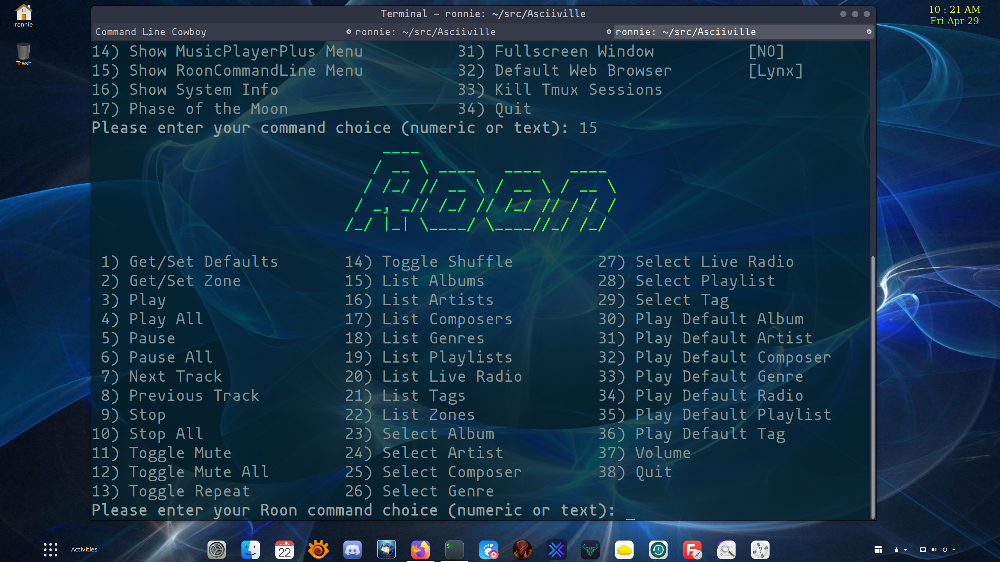

# Asciiville

Asciiville is where you go for ASCII art, animations, and utilities.
The Asciiville project provides integration and extension of several
packages as well as providing convenience commands to invoke a variety
of components used to display ASCII art, animations, and utilities.

## Table of contents

1. [Overview](#overview)
1. [Asciiville Commands](#asciiville-commands)
1. [Quickstart](#quickstart)
1. [Requirements](#requirements)
1. [Installation](#installation)
    1. [Debian package installation](#debian-package-installation)
    1. [RPM package installation](#rpm-package-installation)
    1. [BB AAlib Demo](#bb-aalib-demo)
1. [Configuration files](#configuration-files)
1. [Documentation](#documentation)
    1. [Btop++ README](#btop++-readme)
    1. [Man Pages](#man-pages)
    1. [Usage](#usage)
    1. [Example invocations](#example-invocations)
1. [Figlet fonts](#figlet-fonts)
1. [Build](#build)
1. [Removal](#removal)
1. [History](#history)
1. [Screenshots](#screenshots)

## Overview

Asciiville integrations and extensions are aimed at the character
based terminal user. They enable easy to use seamlessly
integrated control of a variety of ASCII art, animation, and
utilities in a lightweight character based environment.

At the core of Asciiville is the `asciiville` command which acts as
a front-end for a variety of terminal commands and `tmux` sessions.

The `asciiville` command can be used to invoke:

* The lightweight character based system monitor, `btop`
* The lightweight character based web browser, `lynx` or `w3m`
* The lightweight character based mail client, `mutt`
* The lightweight character based FTP client, `cbftp`
* The lightweight character based music player, `mpcplus`
* The lightweight character based file manager, `ranger`
* The lightweight character based disk usage analyzer, `gdu`
* One or more terminal emulators running a command
* A tmux session
* A command line web search
* A zoomable map of the world
* Command line character based Twitter client
* A network download/upload speed test
* The AAlib BB demo running in a tmux session (Debian based systems only)
* Character based ASCII art and image to ascii conversion utility `jp2a`
* Display system info
* Display the Phase of the Moon
* Display a weather report
* Display the MusicPlayerPlus or RoonCommandLine interactive menus
* Any character based client the user wishes to run
* One of several asciimatics animations optionally accompanied by audio

Integration is provided for:

* [btop](btop/README.md), character based system monitor
* [cbftp](cbftp/README), character based FTP client
* [ddgr](ddgr/README.md), command line web search
* [lynx](https://lynx.invisible-island.net/), character based web browser
* [w3m](http://w3m.sourceforge.net/), another character based web browser
* [mutt](http://www.mutt.org/), character based email client
* [ranger](https://ranger.github.io/), character based file manager
* [gdu](https://github.com/dundee/gdu#readme), character based disk usage analyzer
* [mpcplus](https://github.com/doctorfree/MusicPlayerPlus/blob/master/mpcplus/README.md), featureful ncurses based Music Player client
* [mplayer](http://mplayerhq.hu/design7/info.html), a media player
* [asciimatics](https://github.com/peterbrittain/asciimatics) - automatically display a variety of character based animation effects
* [asciinema](https://asciinema.org/) - automatically create ascii character based video clips
* [rainbowstream](https://github.com/orakaro/rainbowstream) - command line character based Twitter client
    * See [the rainbowstream usage manual](https://rainbowstream.readthedocs.io/en/latest/#usage) to get started
* [mapscii](https://github.com/rastapasta/mapscii#readme), zoomable map of the world
* [tmux](https://github.com/tmux/tmux/wiki), a terminal multiplexer
* [wttr.in](https://github.com/chubin/wttr.in), console-oriented weather report
* Enhanced key bindings for extended control of terminal windows
* Several terminal emulators
    * xfce4-terminal
    * gnome-terminal
    * tilix
    * cool-retro-term
* [MusicPlayerPlus](https://github.com/doctorfree/MusicPlayerPlus#readme), character based suite of commands to manage music server and player
* [RoonCommandLine](https://github.com/doctorfree/RoonCommandLine#readme), command line control of the Roon audio system over a local network

### Asciiville Commands

Asciiville adds the following commands to your system:

* **asciiville** : primary user interface, invokes terminal emulators, ascii animations, system monitor, mail client, file manager, web browser, and more
* **btop** : character based system monitor
* **cbftp** : character based FTP client
* **ascinit** : one-time initializaton of a user's Asciiville configuration
* **btop-tmux** : runs btop in a tmux session
* **bb-tmux** : runs aalib bb demo in a tmux session
* **asciisplash** : fun ascii art screens using ASCIImatics animations. Ascii art commands:
    * **asciiart** : ASCIImatics animated art images
    * **asciijulia** : ASCIImatics animated zoom on a Julia Set
    * **asciiplasma** : ASCIImatics animated plasma graphic
    * **asciimpplus** : ASCIImatics animated Music Player Plus splash screen
* **chktermcolor** : checks if a terminal has 24-bit true color support
* **ddgr** : command line web search
* **jp2a** : image to ascii conversion utility
* **mapscii** : character based zoomable map of the world
* **rainbowstream** : command line Twitter client
* **set_xfce_trans** : sets an xfce4-terminal window's transparency level

Additional detail and info can be found in the
[Asciiville Wiki](https://github.com/doctorfree/Asciiville/wiki).

## Quickstart

* Install the latest Debian or RPM format installation package from the [Asciiville Releases](https://github.com/doctorfree/Asciiville/releases) page
* Run the `ascinit` command (must be done as your normal user, no need for `sudo`)
* Initialize the command line Twitter client by invoking the `rainbowstream` command and authorizing the app to access your Twitter account
* Execute the `asciiville` command in interactive menu mode by running `asciiville -i`
* See the [online asciiville man page](https://github.com/doctorfree/Asciiville/wiki/asciiville.1) or `man asciiville` for different ways to invoke the `asciiville` command

## Requirements

Asciiville can be installed on Debian or RPM based Linux systems.
All of the following dependencies/requirements are automatically
installed if needed when using the Debian or RPM format package install.

* tilix (>= 1.9.1)
* xfce4-terminal (>= 0.8.9.1)
* cool-retro-term (>= 1.1.1)
* tmux
* asciimatics
* asciinema
* lynx
* mutt
* ranger
* gdu
* mplayer

## Installation

Asciiville v1.3.0 and later can be installed on Linux systems using
either the Debian packaging format or the Red Hat Package Manager (RPM).
Currently tested platforms include Ubuntu Linux 20.04, Fedora Linux 35,
and Raspbian Linux Bullseye. Installation packages are provided for
the `amd64` and `armhf` architectures in Debian packaging format and the
`x86_64` architecture in Red Hat package manager (RPM) format.

See the [Build](#build) section below to compile and build a package on
an Linux platform other than those for which packages are provided.

### Debian package installation

Many Linux distributions, most notably Ubuntu and its derivatives, use the
Debian packaging system.

To tell if a Linux system is Debian based it is usually sufficient to
check for the existence of the file `/etc/debian_version` and/or examine the
contents of the file `/etc/os-release`.

To install on a Debian based Linux system, download the latest Debian format
package from the
[Asciiville Releases](https://github.com/doctorfree/Asciiville/releases).

Install the Asciiville package by executing the command

```console
sudo apt install ./Asciiville_<version>-<release>.amd64.deb
```
or
```console
sudo dpkg -i ./Asciiville_<version>-<release>.amd64.deb
```

or, on a Raspberry Pi:

```console
sudo apt install ./Asciiville_<version>-<release>.armhf.deb
```
or
```console
sudo dpkg -i ./Asciiville_<version>-<release>.armhf.deb
```

### RPM package installation

Red Hat Linux, SUSE Linux, and their derivatives use the RPM packaging
format. RPM based Linux distributions include Fedora, AlmaLinux, CentOS,
openSUSE, OpenMandriva, Mandrake Linux, Red Hat Linux, and Oracle Linux.

To install on an RPM based Linux system, download the latest RPM format
package from the
[Asciiville Releases](https://github.com/doctorfree/Asciiville/releases).

Install the Asciiville package by executing the command

```console
sudo dnf localinstall ./Asciiville_<version>-<release>.x86_64.rpm
```
or
```console
sudo rpm -i ./Asciiville_<version>-<release>.x86_64.rpm
```

### BB AAlib Demo

The BB AAlib Demo is not included in some distributions' default RPM
repositories. Because of that, it is not included as a dependency in
RPM installs. However, the `asciiville` command will utilize the BB Demo
if it is installed. To activate this feature it may be necessary to
manually install the `bb` package. This may entail enabling a third-party
repository. For example, on Fedora Linux, to install `bb`:

* Add RPM Fusion repositories to your system
* Download latest rpmsphere-release rpm from
    * https://github.com/rpmsphere/noarch/tree/master/r
* Install rpmsphere-release rpm:
    * `sudo rpm -Uvh rpmsphere-release*rpm`
* Install bb rpm package:
    * `sudo dnf install bb`

The BB AAlib Demo is not required. It's just a fun demo.

## Configuration files

Asciiville creates several default configuration files for utilities
included in the distribution. Examine these files to further customize
each program. The default configuration generated when running the
`ascinit` command should suffice and may be satisfactory.

Generated configuration files include:

* `$HOME/.config/btop/btop.conf` : Btop++ system monitor
* `$HOME/.mutt/muttrc` : Mutt email client
* `$HOME/.mutt/colors` : Mutt email client color palette
* `$HOME/.config/neofetch/config.conf` : NeoFetch system info script
* `$HOME/.rainbow_config.json` : Rainbowstream Twitter client
* `$HOME/.config/ranger/rifle.conf` : Rifle, Ranger's file opener
* `$HOME/.tmux.conf` : Tmux terminal multiplexer

These override or extend the settings in the utilities' global configuration
files, typically installed in `/etc/`. For example, the global configuration
for the Ranger File Manager can be found in `/etc/ranger/config/`. The Lynx
web browser configuration is in `/etc/lynx/`, and the W3M web browser is
configured in `/etc/w3m/`.

## Documentation

All Asciiville commands have manual pages. Execute `man <command-name>`
to view the manual page for a command. The `asciiville` frontend is the primary
user interface for Asciiville and the manual page for `asciiville` can be
viewed with the command `man asciiville`. Most commands also have
help/usage messages that can be viewed with the **-u** argument option,
e.g. `asciiville -u`.

### Btop++ README
- [**btop/README.md**](btop/README.md) - Introduction to the btop system monitor

### Cbftp README
- [**cbftp/README**](cbftp/README) - Introduction to the cbftp FTP client
- [**Video on Cbftp**](https://youtu.be/dOIwg9nMF10) - Video introduction to the cbftp FTP client

### Man Pages

- [**asciiville**](markdown/asciiville.1.md) : Primary Asciiville user interface
- [**asciiart**](markdown/asciiart.1.md) : asciimatics animation of art images
- [**asciijulia**](markdown/asciijulia.1.md) : asciimatics animation of a Julia Set
- [**asciimpplus**](markdown/asciimpplus.1.md) : asciimatics animation of Asciiville intro
- [**asciiplasma**](markdown/asciiplasma.1.md) : asciimatics animation with Plasma effect
- [**mpcinit**](markdown/mpcinit.1.md) : Asciiville initialization
- [**btop-tmux**](markdown/btop-tmux.1.md) : Asciiville in a tmux session
- [**btop**](markdown/btop.1.md) : Asciiville system monitor
- [**cbftp**](markdown/cbftp.1.md) : Asciiville FTP client
- [**show_ascii_art**](markdown/show_ascii_art.1.md) : Display ascii art, convert images to ascii art
- [**asciisplash-tmux**](markdown/asciisplash-tmux.1.md) : Asciiville asciimatics animations in a tmux session
- [**asciisplash**](markdown/asciisplash.1.md) : Asciiville asciimatics animations

### Usage

The usage message for `asciiville` provides a brief
summary of the command line options:

```
Usage: asciiville [-a] [-A] [-b] [-c command] [-d] [-f] [-F] [-g] [-i] [-I]
		[-jJ] [-k] [-l] [-L] [-m] [-M] [-n num] [-N] [-p] [-P script] [-r] [-R]
		[-s song] [-S] [-t] [-T] [-v] [-V show] [-w] [-x] [-X] [-y] [-z] [-u]

Terminal/Command options:
	-c 'command' indicates use 'command'
		If 'command' is keyword 'maps' then display a map using mapscii
		If 'command' is keyword 'moon' then display the phase of the Moon
		If 'command' is keyword 'search' then a web search is performed
		If 'command' is keyword 'speed' then a speed test is performed
		If 'command' is keyword 'twitter' then a Twitter client is run
		If 'command' is keyword 'weather' then display a weather report
		Otherwise, 'command' will be executed in a terminal window
	-d indicates use disk usage analyzer as default command
	-f indicates use cbftp/ncftp as the default command
	-F indicates fullscreen display
	-g indicates use gnome terminal emulator
	-i indicates start asciiville in interactive mode
	-I indicates display system info
	-l indicates use lynx web browser as the default command
	-L indicates use lolcat coloring where appropriate
	-P script specifies the ASCIImatics script to run in visualizer pane
	-r indicates use retro terminal emulator
	-t indicates use tilix terminal emulator
	-V 'show' displays an ascii art slide show
		'show' can be Art, Fractals, Lyap, Mixed, Owls, Waterfalls
	-w indicates use w3m web browser as the default command
	-x indicates use xfce4 terminal emulator
	-X indicates run command in current terminal window
	-y indicates use ranger file manager as the default command
	-z indicates use mutt email client as the default command

ASCIImatics animation options:
	-A indicates use Art Images scenes in ASCIImatics display
	-a indicates play audio during ASCIImatics display
	-b indicates use backup audio during ASCIImatics display
	-j indicates use Julia Set scenes in ASCIImatics display
	-J indicates Julia Set with several runs using different parameters
	-m indicates use MusicPlayerPlus scenes in ASCIImatics display
	-M indicates use MusicPlayerPlus MPD client as default command
	-n num specifies the number of times to cycle ASCIImatics scenes
	-N indicates use alternate comments in Plasma ASCIImatics scenes
	-p indicates use Plasma scenes in ASCIImatics display
	-s song specifies a song to accompany an ASCIImatics animation
		'song' can be the full pathname to an audio file or a
		relative pathname to an audio file in the MPD music library
		or /home/ronnie/Music/
	-S indicates display ASCIImatics splash animation

General options:
	-k indicates kill Asciiville tmux sessions and ASCIImatics scripts
	-R indicates record tmux session with asciinema
	-T indicates use a tmux session for either ASCIImatics or command
	-v displays the Asciiville version and exits
	-u displays this usage message and exits

Invoked without any arguments, 'asciiville' will display a menu
```

```
Usage: show_ascii_art [-a art] [-A art_dir] [-b] [-c] [-C]
	[-d font_dir] [-D seconds] [-F large_font] [-f small_font] [-g]
	[-i image] [-l] [-L] [-n tabs] [-N depth] [-o] [-p palette] [-q] [-r] [-s show]
	[-S] [-u] [-t first_text] [-T second_text] [-h height] [-w width]
Where:
	-a 'art' specifies which ascii art to display
	-A 'art_dir' specifies the path to the ascii art folder
	-b when generating ascii art use a border
	-c when generating ascii art use ANSI colors
	-C center ascii art on screen if border detected
	-d 'font_dir' specifies the path to the figlet fonts
	-D 'seconds' specifies the delay, in seconds, between screens
	-g convert image to grayscale
	-i 'image' specifies an image file to convert to ascii art
	-l use lolcat coloring
	-L lists the ascii art in the 'art_dir' and exits
	-f 'small_font' specifies the figlet font to use for small text
	-F 'large_font' specifies the figlet font to use for large text
	-n 'tabs' specifies the number of tabs to indent image display
	-N 'depth' specifies the color depth
		'depth' can be '4' (for ANSI), '8' (for 256 color palette)
		or '24' (for truecolor or 24-bit color)
	-o indicates overwrite any existing ascii art when saving
	-p 'palette' specifies which character set to use for ascii art
		'palette' can be one of 'def', 'long', 'rev', 'longrev'
		'def' is the default set, 'long' a long set,
		'rev' reverses default, 'longrev' reverses long
		Any other argument to '-p' will be taken as the character set
	-q don't display text, just the ascii art
	-r indicates select random fonts
	-s 'show' slide show of ascii art
		'show' can be Art, Fractals, Lyap, Owls, Waterfalls, Mixed
	-S indicates save converted image ascii art in art_dir
	-t 'first_text' specifies the first text to display
	-T 'second_text' specifies the second text to display
	-u displays this usage message and exits
	-h 'height' specifies the height of the converted ascii art
	-w 'width' specifies the width of the converted ascii art
		If only one of 'width' and 'height' is provided,
		calculate the other from image aspect ratio
```

```
Usage: asciisplash [-A] [-a] [-b] [-C] [-c num] [-d] [-jJ] [-m] [-p] [-s song] [-u]
Where:
	-A indicates use all effects
	-a indicates play audio during ASCIImatics display
	-b indicates use backup audio during ASCIImatics display
	-C indicates use alternate comments in Plasma effect
	-c num specifies the number of times to cycle
	-d indicates enable debug mode
	-j indicates use Julia Set effect
	-J indicates Julia Set with several runs using different parameters
	-m indicates use Asciiville effect
	-p indicates use Plasma effect
	-s song specifies the audio file to play as accompaniment
		'song' can be the full pathname to an audio file or a relative
		pathname to an audio file in the MPD music library or
		$HOME/Music/
	-u displays this usage message and exits
```

### Example invocations

The `asciiville` command is intended to serve as the primary interface to
invoke commands. The `asciiville` command utilizes several different terminal
emulators and can also be used to invoke any specified command. Some example
invocations of `asciiville` follow.

Open the btop client in fullscreen mode:

`asciiville -F`

Open the btop client in fullscreen mode using the tilix terminal emulator

`asciiville -F -t`

Open the btop client in the cool-retro-term terminal:

`asciiville -r`

To test the btop lyrics fetchers:

`btop --test-lyrics-fetchers`

## Figlet fonts

Asciiville installs many new Figlet Fonts in addition to those installed
by the `pyfiglet` Python package. These fonts are used by the `asciimatics`
Python package. To view a complete list of the installed `pyfiglet` fonts,
run the command `pyfiglet -l`. To see an example rendering of each of the
installed `pyfiglet` fonts including those installed by `Asciiville`,
run the command `show_figlet_fonts`. There are many fonts so you may wish
to redirect the output of the show_figlet_fonts command for use with an
editor or pager:

```console
show_figlet_fonts > figlet-fonts-examples.txt
less figlet-fonts-examples.txt
```

For an example of how to use the Figlet Fonts in an asciimatics animation,
see `/usr/bin/asciiart`.

## Build

To compile and build a Debian or RPM format package on a Linux architecture
for which a package is not provided, an appropriate development environment
must be installed.

On a Debian based system:

```console
sudo apt update -y
sudo apt upgrade -y
sudo apt install build-essential coreutils git make tar zstd make g++ \
    libssl-dev libncursesw5-dev gcc-10 g++-10 cpp-10
sudo update-alternatives --install /usr/bin/gcc gcc /usr/bin/gcc-10 100 \
    --slave /usr/bin/g++ g++ /usr/bin/g++-10 \
    --slave /usr/bin/gcov gcov /usr/bin/gcov-10
```

On an RPM based system:

```console
sudo dnf update
sudo dnf groupinstall "Development Tools" "Development Libraries"
```

Each platform may differ in package names, versions, and installation command.
It may require some iterations of this process to get all required development
packages installed.

Once you have an appropriate development environment setup, retrieve the
`Asciiville` source, compile the included utilities, and create an installation
package:

```console
git clone https://github.com/doctorfree/Asciiville
cd Asciiville
```

On Debian based systems, run the command `./mkdeb` in the `Asciiville` directory.

On RPM based systems, run the command `./mkrpm` in the `Asciiville` directory.

A successful compilation and packaging will produce distribution/installation
files in `./releases/<version>/`.

## Removal

On Debian based Linux systems where the Asciiville package was installed
using the Asciiville Debian format package, remove the Asciiville
package by executing the command:

```console
    sudo apt remove asciiville
```
or
```console
    sudo dpkg -r asciiville
```

On RPM based Linux systems where the Asciiville package was installed
using the Asciiville RPM format package, remove the Asciiville
package by executing the command:

```console
    sudo dnf remove Asciiville
```
or
```console
    sudo rpm -e Asciiville
```

The Asciiville package can be removed by executing the "Uninstall"
script in the Asciiville source directory:

```console
    git clone https://github.com/doctorfree/Asciiville
    cd Asciiville
    ./Uninstall
```

## History

ASCII art is a graphic design technique that uses computers for presentation
and consists of pictures pieced together from the 95 printable (from a total
of 128) characters defined by the ASCII Standard from 1963 and ASCII compliant
character sets with proprietary extended characters (beyond the 128 characters
of standard 7-bit ASCII). The term is also loosely used to refer to text based
visual art in general. ASCII art can be created with any text editor, and is
often used with free-form languages. Most examples of ASCII art require a
fixed-width font (non-proportional fonts, as on a traditional typewriter) such
as Courier for presentation.

Among the oldest known examples of ASCII art are the creations by computer-art
pioneer Kenneth Knowlton from around 1966, who was working for Bell Labs at the
time. "Studies in Perception I" by Ken Knowlton and Leon Harmon from 1966 shows
some examples of their early ASCII art.

ASCII art was invented, in large part, because early printers often lacked
graphics ability and thus characters were used in place of graphic marks.
Also, to mark divisions between different print jobs from different users,
bulk printers often used ASCII art to print large banner pages, making the
division easier to spot so that the results could be more easily separated
by a computer operator or clerk. ASCII art was also used in early e-mail
when images could not be embedded.

However, text art predates computers. Perhaps the earliest use of characters
in art was in ancient Greece during the 3rd and 2nd centuries BCE with shaped
or patterned poems referred to as "concrete poetry". In this art form, the
words of a poem are arranged in such a way as to depict their subject.

Early religious examples of shaped poems in English include "Easter Wings"
and "The Altar" in George Herbert's The Temple (1633):

<p float="left">
Easter Wings<br/>
  
</p>

Text artists in the 19th century invented a novel technique for creating art:
feeding paper into the rollers of typewriters numerous times, each at a
different angle to allow the overprinting and fine-tuning of an image.

<p float="left">
Typewriter art by Flora F.F. Stacey from 1898<br/>
  
</p>

Typewriter art was succeeded by Teletype art using character sets such as the
Baudot code which predated ASCII. Text images produced on a TTY or RTTY have
been discovered as early as 1923. In the 1960s Andries van Dam and Kenneth
Knowlton were producing realistic images using line printers by overprinting
several characters on top of one another. This was still not ASCII art as they
were using EBCDIC rather than ASCII but it was astonishingly good.

Line printer art flourished throughout the 1970s as anyone who had a job in
a computer lab back then will tell you. Everybody learned how to print a
Snoopy banner. In the late 1970s and early 1980s computer bulletin board
systems, email users, game designers, Usenet news groups, and others
began using ASCII art to represent images. ASCII artists invented Emoticons,
short small combinations of characters which represented the user's
emotional state - happy, sad, angry, and more. Email messages and Usenet
newsgroups were littered with :) and {:> and the Golden Age of ASCII art
flourished throughout the 1990s.

This technique of representing images as text found its way into the source
code of computer programs as a way to represent company or product logos.
In some cases, the entire source code of a program is a piece of ASCII art.
For instance, an entry to one of the earlier "International Obfuscated C Code
Contest" is a program that adds numbers, but visually looks like a binary
adder drawn in logic ports.

ANSI art is similar to ASCII art, but constructed from a larger set of 256
letters, numbers, and symbols — often referred to as extended ASCII. ANSI art
also contains special ANSI escape sequences that can be used to color text.

The rise of the Internet and graphical desktop environments saw the decline
of BBSes and character based user environments which made ASCII and ANSI art
harder to create and to view due to the lack of software compatible with the
new dominant operating system, Microsoft Windows.

By the end of 2002 all traditional ANSI art groups like ACiD, ICE, CIA, Fire,
Dark and many others were no longer making periodic releases of artworks,
called "artpacks" and the community of artists almost vanished.

ASCII and ANSI art resurrected in 2022 with the publication of "Asciiville",
a compendium of art, animation, utilities, and integrated components all
utilizing character based graphics. Haha! Just kidding. Asciiville leverages
the resurgence of interest in character based graphics accompanied by many
recent advances like Figlet Fonts, Lolcat, lsd, asciimatics, asciinema,
btop, jp2a, cbftp, and more. These modern utilities and character based
components have breathed new life into the ASCII art community and produced
many beautiful works of art and animation.

## Screenshots

<p float="left">
Asciiville Main Menu<br/>
  
  
</p>
<p float="left">
Asciiville Sub-Menus: Asciimatics Animations, MusicPlayerPlus, and RoonCommandLine<br/>
  
  
  
</p>

