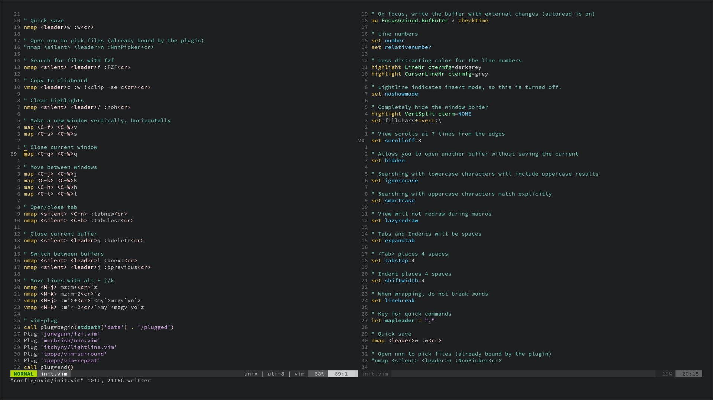
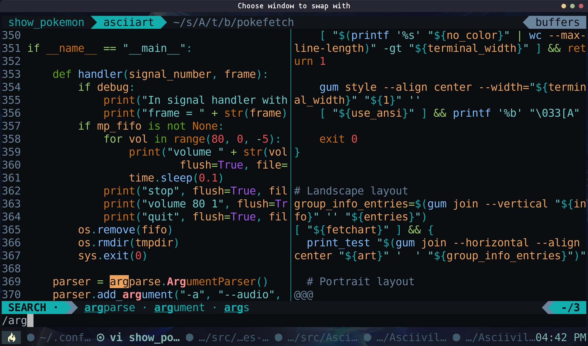
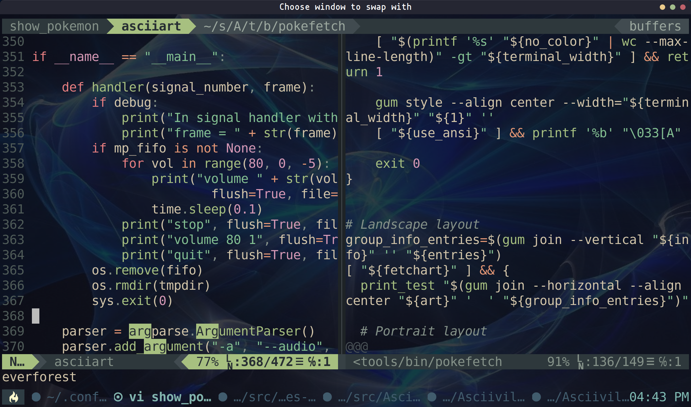

# Asciiville Neovim text editor

[Neovim](https://neovim.io) is a fork of the [Vim](https://en.wikipedia.org/wiki/Vim_(text_editor)) text editor that strives to improve the extensibility and maintainability of Vim. Some features of the fork include built-in Language Server Protocol support, support for asynchronous I/O, and support for scripting using Lua.



## Table of Contents

1. [Introduction](#introduction)
1. [Installation](#installation)
1. [Configuration](#configuration)
    1. [Language servers](#language-servers)
    1. [Key mappings](#key-mappings)
1. [Plugins](#plugins)
1. [Screenshots](#screenshots)
1. [Usage](#usage)

## Introduction

Neovim has the same configuration syntax as Vim (unless vim9script is used); thus the same configuration file can be used with both editors, although there are minor differences in details of options. If the added features of Neovim are not used, Neovim is compatible with almost all of Vim's features.

The Neovim project was started in 2014, with some Vim community members offering early support of the high-level refactoring effort to provide better scripting, plugins, and integration with modern GUIs. The project is free software and its source code is available on [GitHub](https://github.com/neovim/neovim).

The Neovim editor is available in native packaging format on almost all Linux distributions as well as packaging for Mac and Windows, making it possible to install it on almost every operating system. However, some distributions provide an older version of Neovim and the Asciiville configuration of Neovim takes advantage of many of the recently implemented features. In order to provide a current version of Neovim on all supported Asciiville platforms, the Asciiville version of Neovim is installed with [Homebrew](https://brew.sh). In addition to installing the latest version of Neovim, the Asciiville initialization process installs a number of Neovim plugins and supporting utilities. This includes extensive support for a wide variety of programming languages, both syntax highlighting and syntax checking as well as autocompletion. The Asciiville configuration of Neovim includes Asciiville themes and color schemes for both Neovim itself and the [Airline status plugin](https://github.com/vim-airline/vim-airline).

Repository: https://github.com/neovim/neovim

Website: https://neovim.io/

## Installation

Neovim is installed during Asciiville initialization with the command
`ascinit`. If you performed the initialization and chose not to install
Neovim, it can be installed later with the command `ascinit neovim`.

The Asciiville Neovim installation installs the latest release of Neovim,
its dependencies, plugins, configuration files, and several utilities
required by Neovim and the plugin extensions.

## Configuration

The primary Neovim configuration and startup file is `$HOME/.config/nvim/init.vim`.

Some common startup options set in this configuration file include:

```vim
set autoindent              " indent a new line the same amount as the line just typed
filetype plugin indent on   " allows auto-indenting depending on file type
set history=256             " Number of things to remember in history
set ruler                   " Show the cursor position all the time
set showcmd                 " Display an incomplete command in statusline
set encoding=utf-8          " Use UTF-8 character encoding
set timeoutlen=250          " Time to wait after ESC (default causes delay)
set clipboard+=unnamed      " Yanks go on clipboard instead.
set pastetoggle=<F10>       " Toggle between paste and normal: pasting from keyboard
set shiftround              " Round indent to multiple of 'shiftwidth'
set tags=.git/tags;$HOME    " Consider the repo tags first, then
set autowrite               " Writes on make/shell commands
set nobackup                "
set nowritebackup           "
set hidden                  " Current buffer to background without writing to disk
set incsearch               " Show matches while typing
set ignorecase              " Be case insensitive when searching
set smartcase               " Be case sensitive when input has a capital letter
set hlsearch                " Highlight search
set tabstop=2               " Tab size eql 2 spaces
set softtabstop=2           " See multiple spaces as tabstops
set shiftwidth=2            " Default shift width for indents
set expandtab               " Replace tabs with ${tabstop} spaces
set smarttab                "
set indentkeys-=0#          " Do not break indent on #
set synmaxcol=250           " limit syntax highlighting to 250 columns
set nonumber                " line numbers Off
set showmatch               " Show matching brackets.
set matchtime=2             " Bracket blinking.
set novisualbell            " No blinking
set noerrorbells            " No noise.
set vb t_vb=                " Disable any beeps or flashes on error
set statusline=%<%f\        " Custom statusline
set foldenable              " Turn on folding
set foldmethod=marker       " Fold on the marker
set foldlevel=100           " Don't autofold anything (but still fold manually)
set foldopen=block,hor,tag  " What movements open folds
set wildmode=longest,list   " get bash-like tab completions
```

Many more settings are included, the above serve as examples only.

In addition to an extensive `$HOME/.config/nvim/init.vim` Neovim initialization
and startup file, Asciiville installs and configures the
[Plug plugin manager](https://github.com/junegunn/vim-plug), a customized
Asciiville color scheme, a customized Airline plugin theme, and configuration
for many Neovim plugins including:

- [coc.nvim](https://github.com/neoclide/coc.nvim)
- [nvim-lspconfig](https://github.com/neovim/nvim-lspconfig)
- [nvim-cmp](https://github.com/hrsh7th/nvim-cmp)
- [nvim-tree.lua](https://github.com/kyazdani42/nvim-tree.lua)
- [telescope.nvim](https://github.com/nvim-telescope/telescope.nvim)
- [nvim-treesitter](https://github.com/nvim-treesitter/nvim-treesitter)

These core plugins and their configuration provide a plugin infrastructure
which many additional plugins can leverage.

Some of the plugins and Neovim configuration are used to provide an
aesthetically pleasing appearance while others contribute functional extensions.
Some are just for fun.

If you have an [OpenAI API Key](https://openai.com/api) set in your shell
environment during Asciiville initialization (the environment variable
`OPENAI_API_KEY`) the initialization will detect that and enable the
Neovim [ChatGPT plugin](https://github.com/jackMort/ChatGPT.nvim). This allows
you to query [ChatGPT](https://openai.com/blog/chatgpt) from within Neovim.

### Language servers

The following language servers and associated Neovim plugins are installed
and configured by Asciiville initialization:

- [ansiblels](https://github.com/ansible/ansible-language-server) : Ansible configuration management language server
- [awk_ls](https://github.com/Beaglefoot/awk-language-server) : AWK language server
- [bashls](https://github.com/mads-hartmann/bash-language-server) : Bash language server
- [ccls](https://github.com/MaskRay/ccls) : C, C++, and Objective-C language server
- [cmake](https://github.com/regen100/cmake-language-server) : CMake language server
- [cssmodules_ls](https://github.com/antonk52/cssmodules-language-server) : CSS module autocompletion and go-to-definition
- [dockerls](https://github.com/rcjsuen/dockerfile-language-server-nodejs) : Docker language server
- [hls](https://github.com/haskell/haskell-language-server) : Haskell language server
- [lua_ls](https://github.com/luals/lua-language-server) : Lua language server
- [pyright](https://github.com/microsoft/pyright) : Python language server and static type checker
- [rust_analyzer](https://github.com/rust-analyzer/rust-analyzer) : Rust language server
- [sqlls](https://github.com/joe-re/sql-language-server) : SQL language server
- [tsserver](https://github.com/typescript-language-server/typescript-language-server) : TypeScript language server
- [vimls](https://github.com/iamcco/vim-language-server) : VimScript language server
- [yamlls](https://github.com/redhat-developer/yaml-language-server) : YAML language server

The Asciiville Neovim installation uses the
[go.nvim Neovim plugin](https://github.com/ray-x/go.nvim) to provide a modern
Go development environment inside Neovim. The go.nvim plugin is based on gopls,
treesitter AST, Dap and a variety of Go tools.

For other language servers, see [LSP server configurations](https://github.com/neovim/nvim-lspconfig/blob/master/doc/server_configurations.md).

The language servers are utilized by the `nvim-lspconfig` and `nvim-cmp` Neovim
plugins to provide diagnostics, syntax highlighting, formatting, and more
for a variety of programming and text formatting languages. For example, when
editing a file these facilities will provide you with a list of suggested
completions as you are typing. When editing a supported language (e.g. Lua,
YAML, Python, C++) the language servers are used to denote errors, warnings,
hints, and info. Help is often available for the word or line on which the
cursor is positioned by typing `Shift-K` and `Ctrl-K`.

The configuration for language servers and facilities used by `nvim-lspconfig`
and `nvim-cmp` can be found in `~/.config/nvim/lua/`. Current support:

```
Parser/Features         H L F I J
  - css                 ✓ . ✓ ✓ ✓
  - javascript          ✓ ✓ ✓ ✓ ✓
  - python              ✓ ✓ ✓ ✓ ✓
  - go                  ✓ ✓ ✓ ✓ ✓
  - json                ✓ ✓ ✓ ✓ .
  - vim                 ✓ ✓ ✓ . ✓
  - lua                 ✓ ✓ ✓ ✓ ✓
  - c                   ✓ ✓ ✓ ✓ ✓
  - help                ✓ . . . ✓
  - query               ✓ ✓ ✓ ✓ ✓
  - yaml                ✓ ✓ ✓ ✓ ✓
  - comment             ✓ . . . .
  - toml                ✓ ✓ ✓ ✓ ✓
  - html                ✓ ✓ ✓ ✓ ✓
  - bash                ✓ ✓ ✓ . ✓
  - cmake               ✓ . ✓ . .
  - regex               ✓ . . . .
  - java                ✓ ✓ . ✓ ✓

  Legend: H[ighlight], L[ocals], F[olds], I[ndents], In[j]ections
```

### Key mappings

Neovim has many built-in
[key bindings](https://neovim.io/doc/user/map.html#key-mapping).
In addition to these, many more key mappings are defined in the Asciiville
Neovim configuration and by plugins.

Key mapping is used to change the meaning of typed keys. The most common use
is to define a sequence of commands for a function key. For example:

```vim
:map <F2> a<C-R>=strftime("%c")<CR><Esc>
```

This key map appends the current date and time after the cursor
(in `<> notation <>`) when the `<F2>` function key is pressed.

Another example key mapping can be seen in the
[SetColorSchemes.vim](https://github.com/doctorfree/SetColorSchemes.vim) plugin.
This plugin provides an easy way to configure which color schemes to use
and how to switch or cycle between them. The list of color schemes
can be specified by setting the `mycolorschemes` global variable.
The default setting for this is:

```vim
let g:mycolorschemes = ['asciiville', 'everforest', 'cool', 'desertink', 'distinguished', 'hybrid', 'luna', 'molokai', 'solarized', 'zenburn']
```

The `SetColorSchemes.vim` plugin creates the following key mappings:

- `<F7>` Previous colorscheme and airline theme
- `<F8>` Next colorscheme and airline theme
- `<F9>` Random colorscheme and airline theme

For example, when `<F8>` is pressed the next colorscheme in the list is used.
Note that both the Neovim colorscheme and the Airline theme are set. These
two color schemes need to be coordinated to provide proper contrast and
readability. The default colorschemes above take care of this. If you change
the `mycolorschemes` global variable make sure to use color schemes with
compatible [Airline themes](https://github.com/vim-airline/vim-airline-themes).

## Plugins

See a list of
[Neovim plugins installed, configured, and enabled in Asciiville](Plugins-urls.md).
Each of the plugins used in the Asciiville Neovim configuration is listed
and linked to its GitHub repository where configuration and user documentation
can be found.

## Screenshots

Neovim editing sessions illustrating `:vsplit <filename>`, Python script on left
and Bash script on right. The first screenshot is using the `asciiville`
colorscheme, the second uses the `everforest` colorscheme, and the third
screenshot is using the `solarized` colorscheme. The colorschemes
and `vim-airline` themes are included with Asciiville and can be switched
between using `<F8>` (along with several other compatible colorschemes).

Here we can see an example of the search bar enabled by the Wilder plugin with
completions and suggestions matching the search. These suggestions can be
rapidly accessed with `<Tab>`.



In this screenshot we see the `vim-airline` plugin status bar. The status bar
displays different information depending on what mode you are in. Color themes
for airline are coordinated with the selected Neovim colorscheme.



This screenshot illustrates the autocompletion and suggestions provided by
the `nvim-cmp` plugin. Custom icons are used to denote type, rounded borders
and styling provide an easy on the eyes look and feel.


## Usage

Extensive documentation for Neovim is available at https://neovim.io/doc/user/

Learning Vi/Vim/Neovim is a lifetime task. It's a complex and expanding Universe.
But getting started isn't too difficult and learning something new everyday is fun.
Don't get discouraged. The reward will be worth the effort.

Most, if not all, of the information in the
[Vim cheat sheet](https://github.com/doctorfree/cheat-sheets-plus/blob/main/text/vim.md)
applies equally to `nvim`.

Asciiville installs and enables the
[Neovim cheatsheets plugin](https://github.com/sudormrfbin/cheatsheet.nvim)
that provides searchable cheatsheets from within Neovim itself.

Neovim and Vim provide several modes for different kinds of text manipulation.

Pressing 'i' in normal mode enters insert mode.
'<Esc>' goes back to normal mode, which doesn't allow regular text insertion.

### Open a file
```shell
nvim path/to/file
```

### Enter text editing mode (insert mode):
```shell
<Esc>i
```

### Copy ("yank") or cut ("delete") the current line (paste it with `P`):
```shell
<Esc>yy|dd
```

### Enter normal mode and undo the last operation:
```shell
<Esc>u
```

### Search for a pattern in the file (press `n`/`N` to go to next/previous match):
```shell
<Esc>/search_pattern<Enter>
```

### Perform a regular expression substitution in the whole file:
```shell
<Esc>:%s/regular_expression/replacement/g<Enter>
```

### Enter normal mode and save (write) the file, and quit:
```shell
<Esc>:wq<Enter>
```

### Quit without saving:
```shell
<Esc>:q!<Enter>
```
